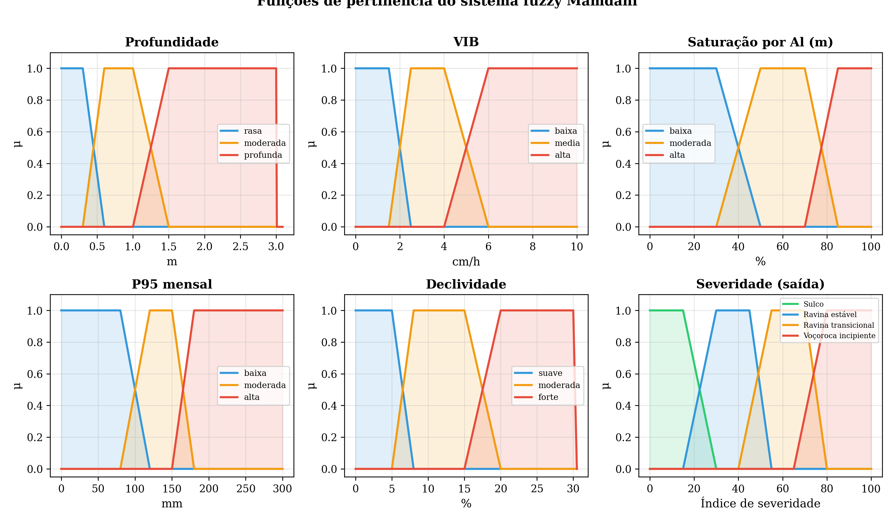
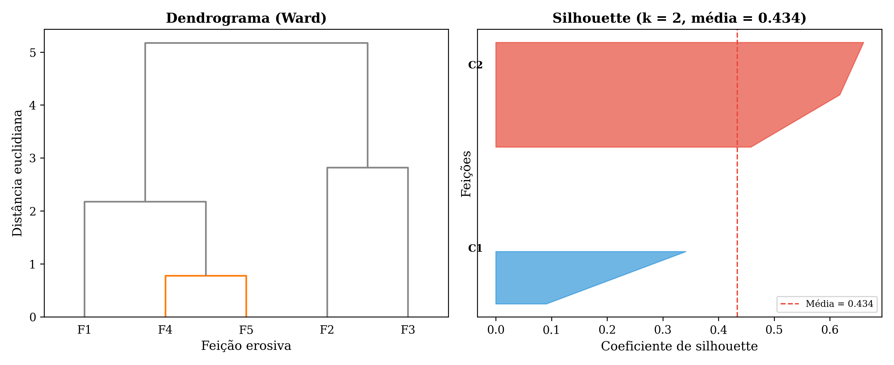
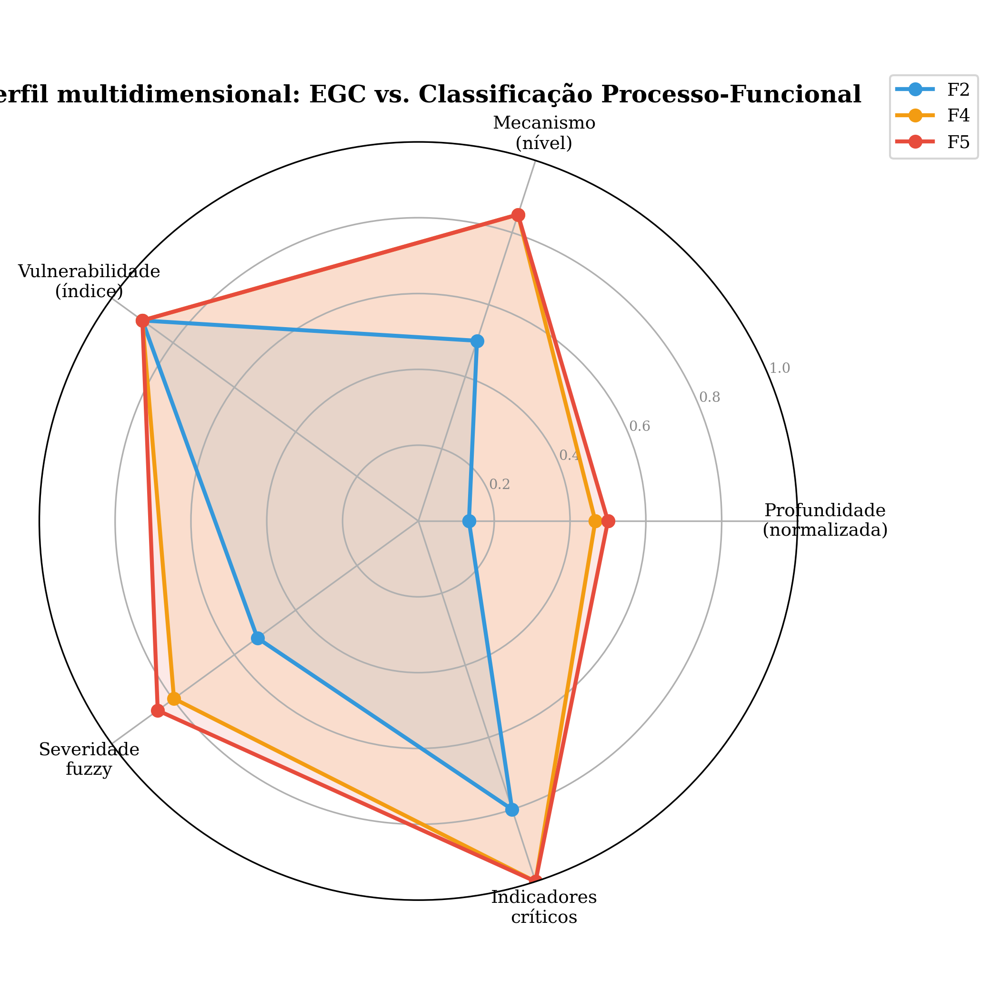

# Material Suplementar

**Nota:** A chave determinística (Fig. 6, Tab. 4), a classificação fuzzy por feição (Fig. 7, Tab. 5) e o ábaco de classificação (Fig. 8) são apresentados no artigo principal (Seções 2.6 e 3.4). O presente material detalha as funções de pertinência, a base de regras, a validação por agrupamento e o perfil radar comparativo.

## S1. Funções de Pertinência e Base de Regras do Sistema Fuzzy Mamdani

As cinco variáveis de entrada foram definidas com funções de pertinência trapezoidais, cujos parâmetros foram calibrados a partir dos limiares empíricos do presente estudo e da literatura (Fig. S1):

- **Profundidade máxima (m):** rasa [0, 0, 0.3, 0.6], moderada [0.3, 0.6, 1.0, 1.5], profunda [1.0, 1.5, 3.0, 3.0]
- **VIB (cm/h):** baixa [0, 0, 1.5, 2.5], média [1.5, 2.5, 4.0, 6.0], alta [4.0, 6.0, 10, 10]
- **Saturação por alumínio, m (%):** baixa [0, 0, 30, 50], moderada [30, 50, 70, 85], alta [70, 85, 100, 100]
- **P95 mensal (mm):** baixa [0, 0, 80, 120], moderada [80, 120, 150, 180], alta [150, 180, 300, 300]
- **Declividade (%):** suave [0, 0, 5, 8], moderada [5, 8, 15, 20], forte [15, 20, 30, 30]

A variável de saída (severidade) foi particionada em quatro conjuntos fuzzy: sulco [0, 0, 15, 30], ravina estável [15, 30, 45, 55], ravina transicional [40, 55, 70, 80] e voçoroca incipiente [65, 80, 100, 100].

{width="6.5in"}

A base de regras compreende 18 regras de inferência IF-THEN, derivadas do conhecimento de campo e da literatura. Exemplos representativos:

- SE profundidade = *profunda* E VIB = *baixa* → severidade = *voçoroca incipiente*
- SE profundidade = *moderada* E VIB = *baixa* E m_Al = *alta* E P95 = *alta* → severidade = *voçoroca incipiente*
- SE profundidade = *moderada* E VIB = *média* E declividade = *moderada* → severidade = *ravina transicional*
- SE profundidade = *rasa* E VIB = *alta* → severidade = *sulco*

A defuzzificação foi realizada pelo método do centróide.

## S2. Análise de Agrupamento Exploratória

Para avaliar se os agrupamentos naturais das feições coincidem com a classificação proposta, realizou-se clustering hierárquico (método de Ward) e k-means (k = 2 e k = 3) sobre a matriz morfométrica normalizada (profundidade, largura, comprimento e declividade) das cinco feições com dados completos (Fig. S2).

O dendrograma de Ward separou as feições em dois agrupamentos principais: (i) Feições 2 e 3 (rasas, curtas) e (ii) Feições 1, 4 e 5 (profundas, longas, com cabeças escarpadas), com coeficiente de silhouette de 0,434 para k = 2. Para k = 3, o silhouette reduziu para 0,298, confirmando que a divisão binária é mais robusta. Esses agrupamentos coincidem com a bifurcação da chave determinística entre feições com 4 indicadores (F2, F3) e 5 indicadores (F1, F4, F5), e com a divisão fuzzy entre ravinas transicionais e voçorocas incipientes.

{width="6.5in"}

## S3. Perfil Multidimensional Comparativo

A Fig. S3 apresenta o perfil radar de três feições representativas (F2 — rasa, F4 — intermediária, F5 — profunda) nas cinco dimensões do sistema processo-funcional. A EGC captura apenas a dimensão de profundidade; as demais (mecanismo, vulnerabilidade, severidade fuzzy, indicadores críticos) são contribuição exclusiva da classificação proposta. A convergência entre F4 e F5 indica trajetória evolutiva compartilhada, enquanto a separação de F2 confirma estágio inicial, apesar da vulnerabilidade funcional igualmente crítica.

{width="6.5in"}

## S4. Código-fonte e Reprodutibilidade

O sistema de classificação (chave determinística, lógica fuzzy Mamdani e clustering exploratório) foi implementado em Python 3.13 utilizando as bibliotecas NumPy 2.2, Pandas 2.2, scikit-fuzzy 0.5.0, scikit-learn 1.6 e SciPy 1.16. O código-fonte completo está disponível em `scripts/classificacao_fuzzy_erosiva.py` no repositório do projeto.

## Referências
