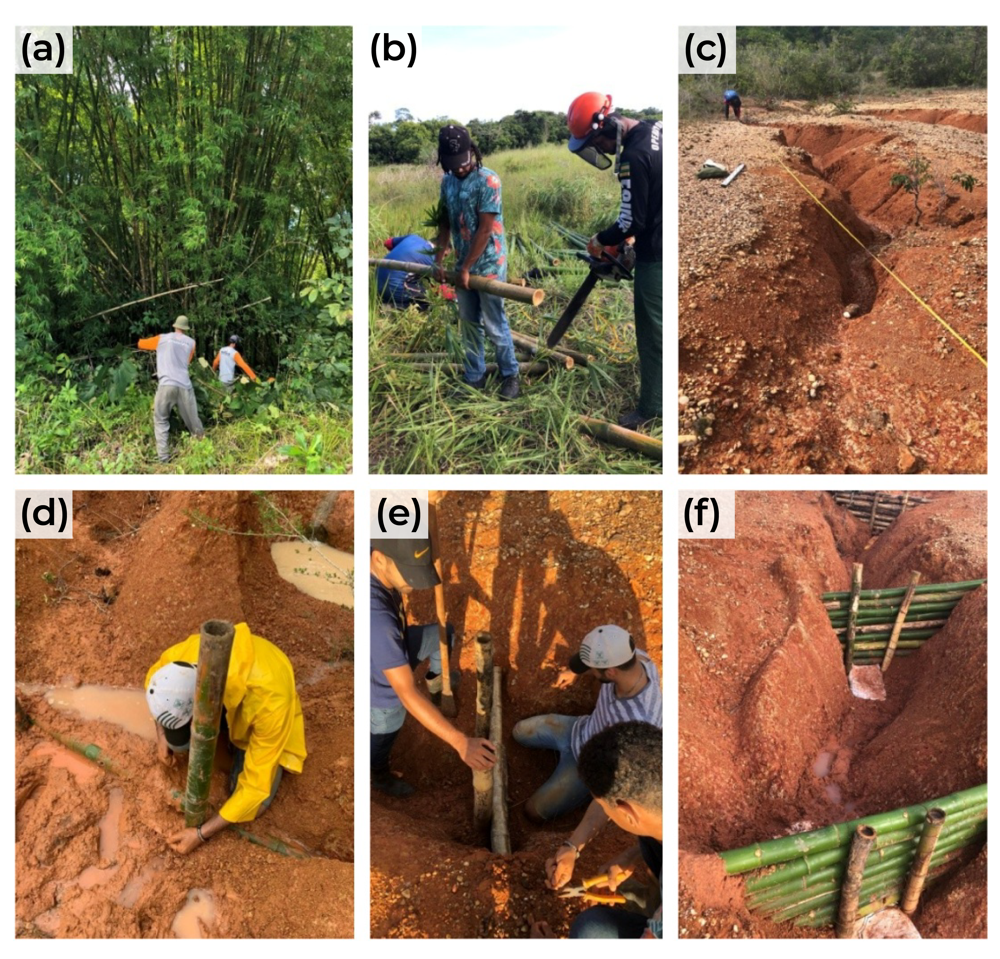
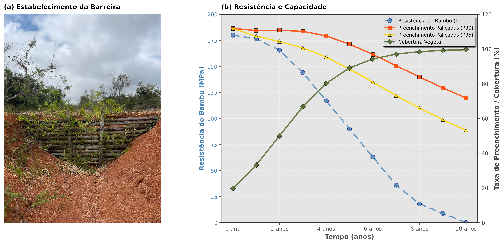

# Resumo

Paliçadas de bambu (*Bambusa vulgaris*) constituem estruturas de bioengenharia de baixo custo para controle de erosão linear, porém a durabilidade do material em contato com solo úmido condiciona a janela operacional da intervenção. Este trabalho avaliou a interação entre a taxa de degradação mecânica do *Bambusa vulgaris* e a taxa de preenchimento sedimentar em um sistema de quatro paliçadas instaladas em uma ravina desenvolvida sobre Plintossolo Argilúvico distrófico, em São Cristóvão, Sergipe. A resistência à tração do bambu (180 MPa inicial) foi modelada por decaimento exponencial com taxas de 0,03 a 0,10 ano$^{-1}$, enquanto a capacidade de retenção foi projetada sob cenários de precipitação média, P90 (168,1 mm/mês) e P95 (181,8 mm/mês). Os resultados indicaram que, sob cenários de alta energia (P90 e P95), a saturação física das paliçadas (preenchimento >100%) precede a falha estrutural do bambu (50% de perda de resistência), projetada para o 5º ano no cenário de referência. O fator de vegetação, modelado por crescimento logístico, atinge 50% por volta do 2º ano e cruza a curva de degradação estrutural próximo ao 3º ano, sinalizando a transição de uma barreira puramente mecânica para estabilização biotécnica, na qual o enraizamento e a cobertura vegetal assumem progressivamente a contenção. Conclui-se que o modo de falha predominante em regime de eventos extremos é o transbordamento por assoreamento, e não a ruptura mecânica, o que orienta protocolos de manutenção para o desassoreamento periódico como prioridade operacional.

**Palavras-chave:** *Bambusa vulgaris*; bioengenharia de solos; degradação estrutural; paliçadas; barreira viva.

# 1. Introdução

O controle de erosão linear por paliçadas (*check dams*) de materiais vegetais combina a função de barreira hidráulica permeável com o potencial de estabelecimento de vegetação ao longo do tempo [@piton_et_al_2017]. No entanto, a eficácia operacional dessas estruturas depende do balanço entre dois processos concorrentes e de escala temporal distinta, a saber, a degradação biológica do material construtivo e o preenchimento sedimentar da capacidade de armazenamento a montante.

O *Bambusa vulgaris* é amplamente utilizado em projetos de bioengenharia tropical por apresentar resistência mecânica inicial elevada (resistência à tração de 120 a 230 MPa), rápido crescimento vegetativo e baixo custo de implantação [@huzita_noda_kayo_2020; @birnnaum_et_al_2018]. Contudo, em condições de contato direto com solo úmido e sem tratamento químico preservativo, o bambu sofre degradação acelerada por ataque biológico (fungos, insetos) e hidrólise, com perda progressiva de resistência mecânica que pode atingir 50% em cinco anos [@ghimire_et_al_2013].

A literatura sobre *check dams* vegetais concentra-se predominantemente na eficiência de retenção de sedimentos e na estabilização geomorfológica de canais [@wang_et_al_2021; @xu_fu_he_2013], sendo escassos os estudos que contraponham explicitamente a curva de degradação do material à curva de preenchimento da capacidade, sobretudo em Plintossolos sob regime de precipitação tropical intensa. Essa lacuna impede a definição de protocolos de manutenção baseados em evidência, nos quais o modo de falha dominante (estrutural vs. funcional por assoreamento) direcione a estratégia operacional.

Este trabalho avaliou a interação temporal entre a perda de integridade mecânica do *Bambusa vulgaris* e a evolução da capacidade de retenção de sedimentos em um sistema de paliçadas em série, identificando o modo de falha predominante e o papel da colonização vegetativa na transição funcional do sistema.

# 2. Materiais e métodos

## 2.1 Sistema experimental

O sistema consiste em quatro paliçadas de *Bambusa vulgaris* instaladas em série ao longo de uma ravina desenvolvida sobre Plintossolo Argilúvico distrófico, localizada na Estação Experimental Campus Rural da Universidade Federal de Sergipe, em São Cristóvão, SE (10°55'28,8" S; 37°11'58,9" O). A ravina foi segmentada em três trechos (superior, intermediário e inferior), com alturas úteis de armazenamento de 50 cm (SUP), 76 cm (MED) e 36 cm (INF). As toras de bambu foram dispostas horizontal e verticalmente, parcialmente enterradas, reforçadas com arame recozido e sacos de ráfia, e a tora basal foi preparada com perfuração de entrenós para induzir brotamento e enraizamento.

{width="6.5in"}

O monitoramento de deposição sedimentar foi realizado mensalmente durante dois anos (2023–2025) pelo método dos pinos [@morgan_2005], e os dados pluviométricos foram obtidos da estação meteorológica de Aracaju-SE, com série diária de 20 anos (2005–2025) agregada em totais mensais para definição dos limiares P90 (168,1 mm/mês) e P95 (181,8 mm/mês).

## 2.2 Modelagem da degradação estrutural

A taxa de degradação da resistência à tração e flexão do *Bambusa vulgaris* foi modelada com base em curvas de decaimento biológico reportadas para bioengenharia em ambiente tropical úmido [@ghimire_et_al_2013], ajustadas para contato direto com solo úmido. A resistência inicial adotada foi de 180 MPa, com densidade de 0,68 g/cm³ e módulo de elasticidade de 12 GPa. O decaimento segue uma função exponencial (Equação 1) com três cenários de taxa de degradação.

| $\displaystyle \sigma(t) = \sigma_0 \cdot e^{-k \cdot t}$ | (1) |
| --- | --- |

Na Equação 1, $\sigma(t)$ é a resistência no tempo $t$ (anos), $\sigma_0$ é a resistência inicial (180 MPa) e $k$ é a taxa de decaimento anual. Três cenários foram considerados, otimista ($k = 0{,}03$ ano$^{-1}$), referência ($k = 0{,}06$ ano$^{-1}$) e pessimista ($k = 0{,}10$ ano$^{-1}$), compatíveis com a faixa de durabilidade observada em intervenções similares sem tratamento químico. O ponto crítico de falha estrutural foi definido em 50% de perda de resistência (90 MPa), atingido no cenário de referência aproximadamente no 5º ano.

A integridade estrutural de campo foi adicionalmente parametrizada por dados de literatura (Tabela 1) que descrevem a retenção percentual de integridade ao longo do tempo para bambu não tratado em contato com solo úmido sob clima tropical.

**Tabela 1** -- Integridade estrutural do bambu não tratado em contato com solo úmido (literatura).

| Ano | Integridade (%) |
|----:|----------------:|
|   0 |             100 |
|   1 |              98 |
|   2 |              92 |
|   3 |              80 |
|   4 |              65 |
|   5 |              50 |
|   6 |              35 |
|   7 |              20 |
|   8 |              10 |

## 2.3 Modelagem da capacidade de retenção e fator de vegetação

A capacidade de preenchimento sedimentar foi projetada para três cenários hidrológicos, condições médias (precipitação mediana da série 2005–2025), P90 (168,1 mm/mês) e P95 (181,8 mm/mês), utilizando as eficiências de retenção observadas no monitoramento ($1{,}12$ a $1{,}97 \times 10^{-4}$ cm/mm) e as alturas úteis por segmento. O percentual de capacidade preenchida foi parametrizado por dados empíricos derivados de *check dams* em condições tropicais (Tabela 2).

**Tabela 2** -- Percentual de capacidade preenchida ao longo do tempo (dados de campo e literatura).

| Ano | Capacidade preenchida (%) |
|----:|--------------------------:|
|   0 |                         0 |
|   1 |                        35 |
|   2 |                        60 |
|   3 |                        75 |
|   4 |                        85 |
|   5 |                        92 |
|   6 |                        96 |
|   7 |                        98 |
|   8 |                        99 |
|   9 |                       100 |
|  10 |                       100 |

O fator de vegetação ($V_f$) foi modelado por função logística (Equação 2), representando a colonização progressiva por brotos e rizomas de *Bambusa vulgaris* a partir das toras basais enterradas.

| $\displaystyle V_f(t) = \frac{1}{1 + e^{-r(t - t_m)}}$ | (2) |
| --- | --- |

Na Equação 2, $r$ controla a taxa de crescimento e $t_m$ é o ponto de inflexão (tempo em que $V_f = 0{,}50$). Os parâmetros adotados ($r = 2{,}0$; $t_m = 2{,}0$ anos) foram calibrados pela observação de campo do vigor vegetativo das estacas no período monitorado.

## 2.4 Análise de modos de falha

A contraposição das curvas de degradação estrutural e de preenchimento de capacidade permitiu identificar o ponto de interseção onde a falha por colapso material precede ou sucede a falha funcional por assoreamento completo. O modo de falha dominante foi determinado pela sequência temporal dos dois eventos (degradação a 50% vs. capacidade a 100%).

# 3. Resultados e discussão

A projeção temporal da capacidade de retenção sob cenários P90 e P95 indicou que a saturação física (>100%) é atingida em menos de 2 anos, ao passo que o declínio crítico da resistência do bambu (50% de perda) ocorre após o 4º ano no cenário de referência (Figura 2b). Essa defasagem temporal sugere que o modo de falha predominante em regime de eventos extremos é o transbordamento por assoreamento, e não a ruptura mecânica da estrutura, implicação operacional direta para a definição de protocolos de manutenção.

A longevidade operacional projetada mostrou-se sensível ao cenário hidrológico. Sob condições médias, o preenchimento total do segmento superior é estimado em 4,8 anos, intervalo que se aproxima da janela de integridade estrutural do cenário de referência. Contudo, sob P90 e P95, a saturação do segmento inferior pode ocorrer em 0,8 ano, período no qual o bambu conserva mais de 94% da resistência inicial (cenário de referência, $k = 0{,}06$, $\sigma(0{,}8) = 171{,}5$ MPa). Essa convergência indica que, durante a fase crítica de preenchimento acelerado, a integridade mecânica permanece adequada para resistir às solicitações hidráulicas, desde que a carga de sedimento acumulado não induza sobrecarga gravitacional nas toras horizontais.

O estabelecimento da barreira viva (Figura 2a) evidencia o vigor vegetativo inicial das estacas de *Bambusa vulgaris*, confirmando a viabilidade do componente biológico da intervenção. O fator de vegetação modelado atinge 50% por volta do 2º ano e cruza a curva de degradação estrutural próximo ao 3º ano (Figura 2b), sinalizando a transição de uma barreira puramente mecânica para uma estabilização biotécnica. Nessa fase, o enraizamento e a cobertura aérea por colmos assumem progressivamente a função de contenção, compensando a perda de resistência do material inerte por ancoragem radicular e dissipação hidráulica distribuída [@romano_et_al_2016].

{width="6.5in"}

A análise por segmento reforça a heterogeneidade do risco operacional. O segmento inferior, que combina menor altura útil (36 cm) e maior eficiência de retenção ($1{,}97 \times 10^{-4}$ cm/mm), é o primeiro a atingir a saturação e, portanto, o ponto prioritário para desassoreamento. O segmento intermediário, apesar da maior altura útil (76 cm), apresenta saturação projetada em 1,0 a 1,1 anos sob P90/P95, indicando que a vantagem geométrica é parcialmente compensada pela elevada taxa de deposição nesse trecho.

A contraposição entre os dados de integridade estrutural de campo (Tabela 1) e preenchimento de capacidade (Tabela 2) indica que, no 3º ano, o bambu retém aproximadamente 80% de sua integridade enquanto a capacidade já atinge 75% de preenchimento. Esse ponto marca o início da zona de risco operacional, onde intervenções de desassoreamento se tornam necessárias para evitar extravasamento antes que a degradação mecânica comprometa a estabilidade da estrutura.

Esse processo de transição funcional é documentado por @bombino_et_al_2019 e @holanda_et_al_2021, que observaram que a colonização vegetal é determinante para a estabilidade de longo prazo de estruturas de bioengenharia após o declínio do componente inerte. A consistência entre o padrão modelado neste trabalho e os relatos de campo desses autores sugere que paliçadas de *Bambusa vulgaris*, desde que projetadas com componente vivo intencional (toras basais preparadas para brotamento), podem sustentar funcionalidade além da vida útil do material construtivo.

# 4. Conclusão

O modo de falha predominante em paliçadas de *Bambusa vulgaris* sob regime de precipitação tropical intensa é a saturação física por assoreamento, que precede temporalmente a falha estrutural do material em todos os cenários hidrológicos simulados. A manutenção operacional deve priorizar protocolos de desassoreamento periódico, especialmente nos segmentos de menor capacidade de armazenamento, onde a saturação pode ocorrer em menos de um ano sob eventos extremos. A colonização vegetativa pelas estacas de bambu representa um mecanismo de sucessão funcional que pode compensar a degradação mecânica a partir do 3º ano, sustentando o controle do escoamento concentrado além da vida útil do material.

# Declarações

**Disponibilidade de dados e códigos**

Os dados e os códigos utilizados neste estudo estão disponíveis no Zenodo em https://doi.org/10.5281/zenodo.18200505.

**Conflito de interesses**

Os autores declaram não haver conflito de interesses.

**Financiamento**

A pesquisa não recebeu financiamento externo.

# Referências

::: {#refs}
:::
