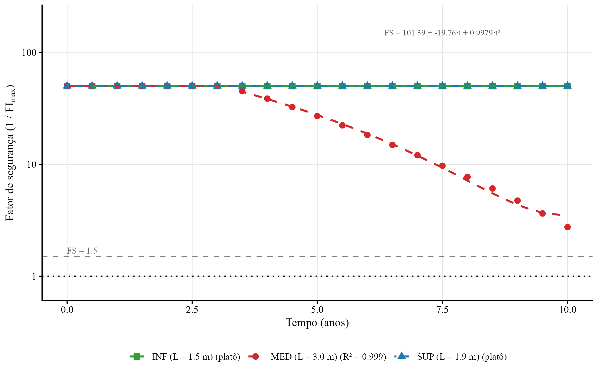
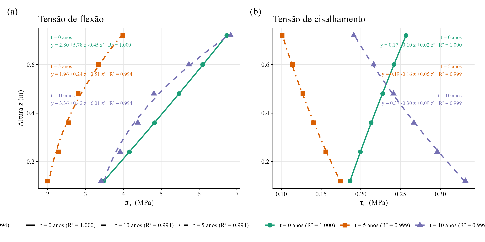
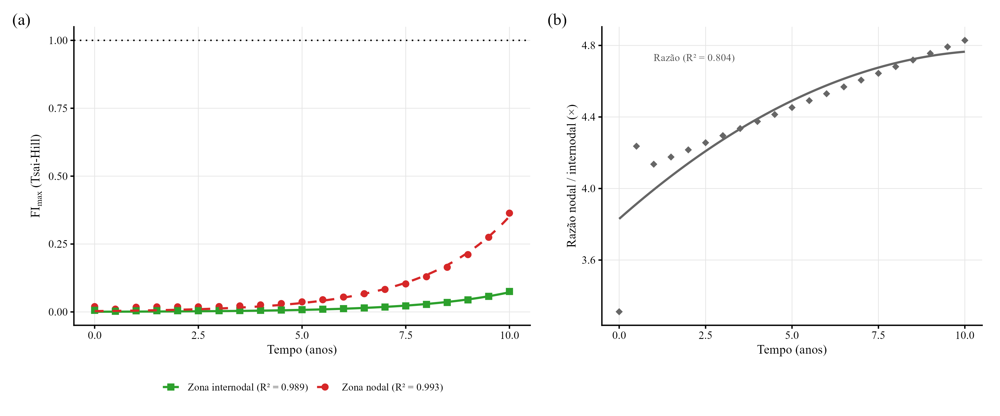
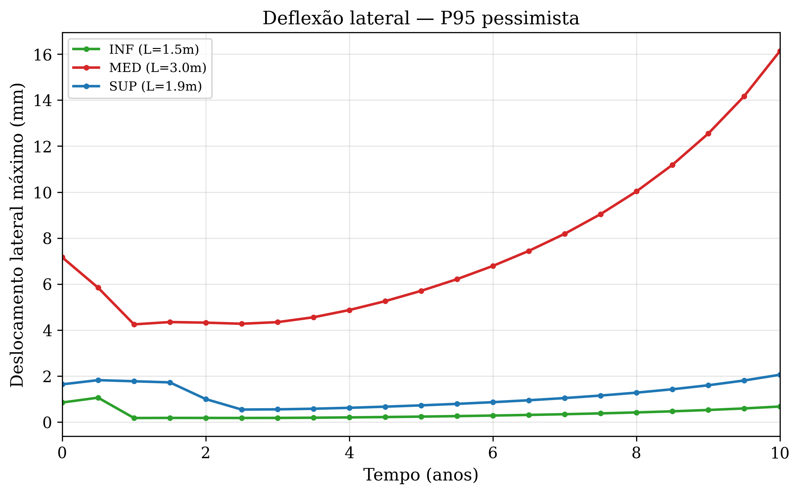

**Luiz Diego Vidal Santos**^1\*^, **Emersson Guedes da Silva**^2^, **Francisco Sandro Rodrigues Holanda**^2^, **Marcos Oliveira Santos**^2^, **Renisson Neponuceno de Araújo Filho**^3^, **Henrique Antonio Silva**^2^, **Mateus Barbosa Santos da Silva**^5^, **Sandro Griza**^4^

^1^ Programa de Pós-Graduação em Planejamento Territorial, Universidade Estadual de Feira de Santana (UEFS), Feira de Santana, BA, Brasil\
^2^ Departamento de Engenharia Agronômica, Universidade Federal de Sergipe (UFS), São Cristóvão, SE, Brasil\
^3^ Departamento de Tecnologia Rural, Universidade Federal Rural de Pernambuco (UFRPE), Recife, PE, Brasil\
^4^ Departamento de Ciência e Engenharia de Materiais, Universidade Federal de Sergipe (UFS), São Cristóvão, SE, Brasil\
^5^ Universidade Estadual de Feira de Santana (UEFS), Feira de Santana, BA, Brasil

^\*^ Autor correspondente: ldvsantos@uefs.br · ORCID: 0000-0001-8659-8557

# Resumo

Paliçadas de bambu são amplamente utilizadas como barreiras permeáveis para controle de erosão linear em bacias hidrográficas tropicais, porém nenhum arcabouço quantitativo permite predizer como a degradação do material interage com o carregamento hidrossedimentológico para determinar sua vida útil funcional. Este estudo avalia a integridade mecânica de paliçadas de *Bambusa vulgaris* ao longo de 10 anos por meio de um modelo tridimensional de elementos finitos (vigas de Euler-Bernoulli, critério de falha ortotrópico de Tsai-Hill) calibrado com dados de monitoramento de campo de dois anos em uma ravina sobre Plintossolo Argilúvico no Nordeste do Brasil, examinando 567 combinações de três taxas de degradação ($k = 0{,}03$ a $0{,}10$ ano$^{-1}$), três cenários hidrológicos (mediano a P95) e 21 passos de tempo. O fator de segurança permaneceu acima de 2,7 em todos os cenários; as estacas verticais concentraram 36% do consumo da capacidade resistente residual, enquanto os colmos horizontais operaram abaixo de 3%. A capacidade de armazenamento sedimentar atingiu preenchimento pleno entre 1,0 e 4,8 anos (invariavelmente antes de qualquer risco de falha estrutural), levando os três cenários hidrológicos a convergirem para a mesma demanda estrutural após a saturação. A taxa de biodegradação, e não a variabilidade pluviométrica, controlou a segurança estrutural além do tempo de saturação sedimentar. Os resultados indicam que o desassoreamento periódico do depósito a montante, e não o reforço estrutural, constitui a intervenção de manutenção prioritária para prolongar a longevidade funcional de paliçadas de bambu no controle de erosão linear.

**Palavras-chave:** controle de erosão linear; paliçada de bambu; retenção de sedimentos; degradação estrutural; análise por elementos finitos; planejamento de manutenção.

# 1. Introdução

A erosão linear é uma fonte dominante de sedimentos em bacias tropicais degradadas, com feições individuais capazes de transportar 10 a 100 t ano$^{-1}$ para os canais a jusante [@poesen_et_al_2003]. Barreiras permeáveis vegetais, notadamente paliçadas de bambu funcionando como barragens de retenção (*check dams*), constituem intervenção de bioengenharia de solos de baixo custo que reduz a velocidade do escoamento concentrado, promove deposição de sedimentos a montante e facilita a estabilização progressiva do canal [@piton_et_al_2017; @bombino_et_al_2019; @chanson_2004]. Em bacias hidrográficas tropicais, o *Bambusa vulgaris* é empregado por combinar resistência mecânica inicial elevada (120 a 230 MPa de resistência à tração), disponibilidade local abrangente e capacidade de brotamento quando enterrado parcialmente no solo [@huzita_noda_kayo_2020; @birnnaum_et_al_2018], o que o torna opção custo-eficaz para o manejo integrado de erosão na escala da bacia.

Contudo, a eficácia operacional dessas estruturas é condicionada pela interação entre a degradação biológica do material construtivo, mediada por ataque fúngico, hidrólise e ação de insetos em contato direto com solo úmido, com perda de até 50% da resistência mecânica em cinco anos para bambu não tratado [@ghimire_et_al_2013], e o preenchimento progressivo da capacidade de armazenamento a montante, cuja taxa depende do regime pluviométrico e da eficiência de retenção.

Estudos sobre barreiras permeáveis em ravinas têm se concentrado predominantemente na eficiência de retenção de sedimentos e na evolução geomorfológica do canal [@wang_et_al_2021; @xu_fu_he_2013], enquanto a integridade estrutural do material ao longo do tempo sob solicitações mecânicas reais permanece pouco investigada. Estudos com compósitos de fibra de bambu em corpos de prova documentam a marcada anisotropia mecânica desse material [@budhe_et_al_2019], porém sem transpô-la para o cenário de estruturas de bioengenharia submetidas a carregamentos hidrossedimentológicos e degradação temporal progressiva. Em particular, a identificação dos pontos críticos de concentração de tensão em toras de bambu, com comportamento ortotrópico e zonas de fragilidade nos nós de entrenó, não foi abordada no contexto de bioengenharia de solos.

A análise por elementos finitos (FEM) permite espacializar o campo de tensões em uma estrutura submetida a carregamentos variáveis no tempo e identificar os modos de falha dominantes (flexão, cisalhamento interlaminar, flambagem) e sua localização ao longo do elemento [@romano_et_al_2016]. Aplicações recentes de modelagem numérica ao dimensionamento de controle de erosão em bacias hidrográficas [@elhakeem_et_al_2017] ilustram o potencial de ferramentas de simulação para embasar o manejo baseado em evidências, porém nenhum arcabouço equivalente existe para estruturas de bioengenharia de bambu. A formulação tridimensional com vigas de Euler-Bernoulli acoplada ao critério de falha de Tsai-Hill para materiais ortotrópicos possibilita quantificar a proximidade da ruptura em cada ponto da malha a cada instante de tempo, integrando o decaimento exponencial das propriedades mecânicas e o incremento progressivo do carregamento ao longo dos 12 graus de liberdade por elemento [@bacharoudis_philippidis_2015].

Além da dimensão estrutural, a longevidade funcional de paliçadas vegetais está associada à recuperação de serviços ecossistêmicos na ravina estabilizada, dado que o acúmulo de matéria orgânica no depósito a montante tende a favorecer a colonização por vegetação espontânea e o restabelecimento progressivo de ciclos biogeoquímicos [@jiang_et_al_2022], tornando a quantificação da margem de segurança mecânica ao longo do tempo condição necessária para avaliar se a estrutura sobrevive tempo suficiente para que esses processos ecológicos se estabeleçam.

Este estudo avalia a integridade mecânica de paliçadas de *Bambusa vulgaris* ao longo de 10 anos, identificando os modos de falha dominantes, os elementos críticos e a relação temporal entre segurança estrutural e preenchimento sedimentar. Hipotetizou-se que a taxa de biodegradação do material, e não o regime hidrológico, controla o fator de segurança em horizontes superiores ao tempo de saturação sedimentar ($T_{sat}$), e que a capacidade de armazenamento tende a atingir saturação antes da falha mecânica, tornando o desassoreamento periódico a intervenção prioritária para prolongar a longevidade funcional da estrutura.

# 2. Materiais e métodos

## 2.1 Sistema experimental e dados de entrada

Quatro paliçadas de *Bambusa vulgaris* (P1 a P4) foram instaladas em série ao longo de uma ravina desenvolvida sobre Plintossolo Argilúvico distrófico, na Estação Experimental Campus Rural da Universidade Federal de Sergipe, em São Cristóvão, SE (10°55'28,8" S; 37°11'58,9" O). O espaçamento entre estruturas foi definido de modo que a base de cada paliçada ficasse em nível com o topo da seguinte a jusante, maximizando o volume de retenção no desnível formado [@emater_2006; @couto_et_al_2010]. A ravina foi segmentada em três trechos funcionais com alturas úteis de armazenamento de 50 cm (segmento superior, SUP), 76 cm (intermediário, MED) e 36 cm (inferior, INF).

A construção da estrutura consistiu na cravação de estacas verticais de bambu a 30 cm de profundidade no leito da ravina, seguida pela fixação de colmos horizontais (longarinas) às estacas mediante amarração com arame recozido (Fig. 1a). Cada colmo horizontal recebeu 15 cm de comprimento adicional em cada extremidade, possibilitando o embutimento nos taludes laterais e conferindo confinamento lateral ao conjunto.

A tora basal foi incorporada após dois meses de enterramento prévio, período que permitiu o desenvolvimento de brotos a partir dos entrenós perfurados e preenchidos com água [@Mira_Evette_2021], com dupla função de propagação vegetativa e barreira contra enxurradas. Para aumentar a eficiência de retenção, sacos de ráfia preenchidos com solo local ou vazios foram fixados na face a montante das paliçadas [@nardin_et_al_2010]. A integridade estrutural do conjunto foi mantida por intervenções periódicas em ciclo de oito meses, com substituição de arames recozidos e renovação dos sacos de ráfia, procedimento voltado a preservar a capacidade de retenção sem bloquear o escoamento nem elevar o risco de colapso do depósito sob eventos de alta energia.

{width="6.5in"}

O monitoramento de campo conduzido na mesma ravina pelo método dos pinos [@morgan_2005] durante dois anos (2023–2025) forneceu as eficiências de retenção por segmento ($1{,}12$ a $1{,}97 \times 10^{-4}$ cm/mm), que parametrizaram as taxas de acúmulo sedimentar do modelo (Fig. 2b). Ao longo de 24 meses, os segmentos individuais contribuíram com 37,7% (SUP), 22,6% (MED) e 39,7% (INF) da massa total retida, enquanto a taxa média de deposição incremental não diferiu entre segmentos (ANOVA, $F = 0{,}27$, $p = 0{,}77$), indicando que o arranjo em série distribui a carga sedimentar de forma uniforme. Após dois anos, a capacidade residual de armazenamento permaneceu superior a 98% em todos os segmentos, confirmando que o sistema operou na fase pré-saturação durante todo o período monitorado. A série pluviométrica diária de 20 anos (2005–2025) da estação de Aracaju-SE definiu os limiares hidrológicos P90 (168,1 mm mês$^{-1}$) e P95 (181,8 mm mês$^{-1}$) adotados nos cenários de carregamento. O índice de erosividade EI30 foi calculado a partir da intensidade máxima em 30 minutos de cada evento de chuva, utilizando dados de pluviógrafo automático com resolução de 10 minutos, conforme protocolo de @wischmeier_smith_1978.

{width="6.5in"}

## 2.2 Modelo geométrico e discretização em elementos finitos

A paliçada foi representada como um pórtico espacial (*space frame*) composto por colmos horizontais empilhados (longarinas) conectados a estacas verticais cravadas no solo (Fig. 3). Cada elemento foi modelado como viga tridimensional de Euler-Bernoulli com 12 graus de liberdade por elemento (6 DOF por nó: três translações e três rotações), seção tubular oca (diâmetro externo 100 mm, diâmetro interno 70 mm, espessura de parede inicial 15 mm), e propriedades ortotrópicas do *Bambusa vulgaris* (Tabela 1).

Do ponto de vista dimensional, a geometria paramétrica distingue os três segmentos de campo, INF (largura 1,50 m, altura 0,36 m), MED (largura 3,00 m, altura 0,76 m) e SUP (largura 1,90 m, altura 0,50 m). As estacas foram posicionadas com espaçamento máximo de 1,50 m (2 a 3 estacas por segmento). Embora a profundidade de cravação em campo seja de 30 cm, o modelo estende cada estaca 0,70 m abaixo do nível do solo para garantir que a condição de engaste total (6 DOF fixos na extremidade inferior) reproduza o confinamento lateral oferecido pelo Plintossolo sem impor rigidez artificial imediatamente na superfície, permitindo que os elementos embebidos desenvolvam momento fletor e cisalhamento ao longo da zona de transição solo-estrutura.

Com espaçamento vertical de 0,12 m, os colmos horizontais totalizaram 3 a 6 camadas por segmento conforme a altura útil. O embutimento lateral dos colmos nos taludes (15 cm por extremidade) foi representado por nós de pino posicionados a 15 cm além das estacas externas (translações fixas, rotações livres), refletindo o confinamento pelo Plintossolo sem impor restrição de momento no ponto de embutimento. Cada vão de colmo entre estacas consecutivas foi subdividido em quatro elementos, e cada trecho de embutimento por dois elementos adicionais de stub, gerando 25 a 72 nós e 26 a 81 elementos por segmento (150 a 432 DOF). As conexões colmo-estaca foram modeladas como junções rígidas (todos os DOF compartilhados no nó de interseção), simplificação da amarração por arame recozido executada em campo, cuja rigidez rotacional finita é discutida adiante.

Para cada elemento da malha, a matriz de rigidez local (12×12) foi montada pela formulação de Przemieniecki [-@przemieniecki_1968] para vigas de Euler-Bernoulli em espaço tridimensional, incluindo rigidez axial, flexão em dois planos ortogonais e torção. A transformação de coordenadas locais para globais empregou a matriz de rotação $\boldsymbol{\Lambda}$ (3×3), expandida em bloco diagonal para 12×12, com eixo local $x$ orientado ao longo do elemento e eixo auxiliar $z$ vertical para elementos horizontais ou $x$ global para elementos verticais. As condições de contorno foram definidas como engaste total (todos os 6 DOF fixos) nos nós das pontas enterradas das estacas, liberando os demais nós para simular a rigidez finita do trecho embebido no solo por meio da deformabilidade do próprio elemento de viga. 

Embora modelos de fundação em molas de Winkler ($k_h \approx 10$–20 MN/m³ para solos argilosos) possam representar de forma mais fiel a interação solo–estaca [@tardio_mickovski_2017], o engaste total constitui hipótese conservadora para o momento na base da estaca, pois impede rotação no ponto de fixação e força a concentração integral do momento fletor nesse nó. A calibração futura de um modelo Winkler para o Plintossolo local exigiria molas lineares distribuídas a cada 10 cm ao longo do trecho embebido, com coeficientes de reação horizontal derivados de ensaios de prova de carga lateral ou correlações empíricas com o índice de consistência do horizonte Bt.

## 2.3 Propriedades do material e modelo de degradação

O *Bambusa vulgaris* foi tratado como material ortotrópico com propriedades mecânicas iniciais ($t = 0$) obtidas da literatura especializada (Tabela 1). Comportamento ortotrópico análogo foi documentado em compósitos de fibra de bambu de espécies neotropicais próximas, como *Guadua angustifolia*, por meio de ensaios de tração e cisalhamento em corpos de prova extraídos pelo método de peeling rotativo [@iwasaki_et_al_2022], corroborando a adequação da hipótese ortotrópica para a família Poaceae. O módulo de elasticidade longitudinal (12 GPa), a resistência à tração (180 MPa) e a resistência ao cisalhamento interlaminar (10 MPa) representam a faixa superior de valores reportados para a espécie em condições de colheita madura e sem tratamento preservativo [@huzita_noda_kayo_2020; @ghimire_et_al_2013].

**Tabela 1** -- Propriedades mecânicas iniciais do *Bambusa vulgaris* adotadas no modelo FEM.

| **Propriedade** | **Símbolo** | **Valor** | **Unidade** |
|---|---|---|---|
| Módulo de elasticidade longitudinal | $E_L$ | 12,0 | GPa |
| Módulo de cisalhamento longitudinal-radial | $G_{LR}$ | 1,0 | GPa |
| Resistência à tração longitudinal | $\sigma_{tL}$ | 180 | MPa |
| Resistência à compressão longitudinal | $\sigma_{cL}$ | 60 | MPa |
| Resistência ao cisalhamento interlaminar | $\tau_{LR}$ | 10 | MPa |
| Coeficiente de Poisson | $\nu_{LR}$ | 0,32 | — |
| Densidade | $\rho$ | 680 | kg/m³ |

Em termos temporais, a degradação de todas as propriedades mecânicas foi modelada por decaimento exponencial (Equação 1), com três cenários de taxa de degradação anual.

| $\displaystyle P(t) = P_0 \cdot e^{-k \cdot t}$ | (1) |
| --- | --- |

Na Equação 1, $P(t)$ é qualquer propriedade mecânica no tempo $t$ (anos), $P_0$ é o valor inicial e $k$ é a taxa de decaimento. Os cenários otimista ($k = 0{,}03$ ano$^{-1}$), referência ($k = 0{,}06$ ano$^{-1}$) e pessimista ($k = 0{,}10$ ano$^{-1}$) cobrem a faixa de durabilidade reportada para bambu não tratado em ambiente tropical úmido [@ghimire_et_al_2013; @romano_et_al_2016]. O cenário de referência ($k = 0{,}06$ ano$^{-1}$) corresponde a uma meia-vida de 11,5 anos, compatível com a perda de 50% da resistência mecânica em cinco anos reportada para bambu sem tratamento preservativo em contato com solo úmido [@ghimire_et_al_2013].

Adota-se a simplificação de taxa $k$ uniforme para todas as propriedades mecânicas. Na prática, dados experimentais sugerem que a resistência ao cisalhamento interlaminar pode degradar até 30% mais rapidamente que a resistência à tração longitudinal, devido à maior vulnerabilidade das interfaces entre lamelas ao ataque fúngico [@shao_et_al_2010]. Essa simplificação é conservadora para o modo de falha por flexão e potencialmente não conservadora para o modo cisalhante; contudo, a dominância do cisalhamento no índice de Tsai-Hill (Seção 3.3) indica que a adoção de $k$ diferencial ($k_{\tau} \approx 1{,}3 \cdot k_{\sigma}$) aumentaria os valores de FI reportados em até 15% sem alterar a hierarquia de modos de falha nem conduzir a FI $\geq 1{,}0$ em nenhuma combinação.

Adicionalmente, a redução progressiva da espessura de parede dos colmos foi modelada por afinamento linear de 1 mm ano$^{-1}$ (espessura inicial de 15 mm, reduzida a 5 mm em $t = 10$ anos), valor representativo da perda de seção por biodegradação periférica em bambu não tratado enterrado parcialmente em solo úmido [@ghimire_et_al_2013].

Nas zonas de nó de entrenó, um fator de redução de 0,65 sobre a resistência ao cisalhamento interlaminar (6,5 MPa em $t = 0$) foi adotado para refletir a descontinuidade microestrutural do diafragma, onde as fibras longitudinais convergem e a resistência à delaminação é inferior à da região internodal [@ghimire_et_al_2013; @meng_et_al_2023].

## 2.4 Modelo de carregamento

O carregamento sobre o pórtico tridimensional combina cinco componentes laterais (direção perpendicular ao plano da paliçada) e uma componente gravitacional, todas variáveis no tempo conforme o preenchimento sedimentar progride.

Na face a montante, abaixo do nível de sedimento, atua o empuxo ativo ($p_{sed}(z,t) = \gamma_s \cdot K_a \cdot (h_{sed}(t) - z)$, com $K_a = 0{,}333$ e $\gamma_s = 15\,000$ N/m³, valor compatível com sedimentos silto-argilosos úmidos típicos de Plintossolos [@rankine_1857]), convertido em carga distribuída por unidade de comprimento ao longo do diâmetro externo de cada colmo. Colmos submersos acima do nível de sedimento recebem adicionalmente a pressão hidrostática ($p_w = \rho_w \cdot g \cdot (h_w - z)$), ao passo que os colmos expostos são solicitados pelo arrasto hidrodinâmico ($q_d = \tfrac{1}{2} C_d \rho_w v^2 D_{ext}$, $C_d = 1{,}2$) e pelo impacto de detritos (400 N para P95, distribuído como pressão uniforme sobre a face exposta $h_{exp} \times L$). O peso próprio ($\rho \cdot A \cdot g$) completa o carregamento como carga gravitacional em todos os elementos.

Todas as cargas distribuídas foram transformadas de coordenadas globais para locais de cada elemento mediante a matriz de rotação $\boldsymbol{\Lambda}$, e as forças nodais equivalentes foram obtidas pela formulação de cargas consistentes do elemento de viga de Euler-Bernoulli (forças transversais $qL/2$ e momentos $\pm qL^2/12$ por componente [@bathe_1996]), transformadas de volta ao sistema global via $\mathbf{T}^T \mathbf{f}_{local}$ e montadas no vetor de forças global. A carga de arrasto e impacto foi escalonada pelo fator logístico de vegetação (Equação 2), que modela a colonização progressiva da face a montante por material vegetal.

| $\displaystyle f_{veg}(t) = 1 - V_{max} \cdot \frac{1}{1 + e^{-r\,(t - t_m)}}$ | (2) |
| --- | --- |

Na Equação 2, $V_{max} = 0{,}30$ é a redução máxima de carga (30%), $r = 2{,}0$ ano$^{-1}$ é a taxa de crescimento logístico e $t_m = 2{,}0$ anos é o ponto de inflexão da curva sigmoide, de modo que o fator reduz progressivamente até 30\% da carga efetiva de arrasto e impacto a partir do 2.º ano. Os parâmetros $V_{max}$, $r$ e $t_m$ foram adotados como valores hipotéticos na ausência de dados quantitativos de cobertura vegetal no sítio experimental; uma análise de sensibilidade com $V_{max}$ variando de 0,15 a 0,45 indicou alterações inferiores a 3\% no FI máximo a $t = 10$ anos, sugerindo que a incerteza neste fator não compromete as conclusões do modelo.

**Tabela 2** -- Tempo estimado até preenchimento pleno (100%) da capacidade de armazenamento por segmento e cenário hidrológico, derivado das eficiências de retenção empíricas ($1{,}12$ a $1{,}97 \times 10^{-4}$ cm/mm) e da série pluviométrica de 20 anos (2005–2025).

| **Segmento** | **$H$ (cm)** | **Mediano (anos)** | **P90 (anos)** | **P95 (anos)** |
|----------|----------:|---------------:|-----------:|-----------:|
| SUP      |        50 |            4,8 |        2,4 |        2,2 |
| MED      |        76 |            2,2 |        1,1 |        1,0 |
| INF      |        36 |            1,7 |        0,8 |        0,8 |

*Nota: Os tempos de saturação são projeções contínuas derivadas das eficiências de retenção empíricas. O modelo FEM avalia a resposta estrutural em passos discretos de 0,5 ano, de modo que $T_{sat}$ fracionários (e.g., 0,8 ano) são interpolados linearmente entre os passos adjacentes (0,5 e 1,0 ano).*

*Nota: A progressão do preenchimento foi parametrizada como linear entre 0% em $t = 0$ e 100% no tempo de saturação ($T_{sat}$), com o percentual em qualquer instante dado por $\min(100,\; t/T_{sat} \times 100)$. Os tempos de saturação derivam da projeção das taxas de deposição mensal,  sob recorrência contínua do regime hidrológico de cada cenário, sobre a altura útil remanescente de cada segmento.*

## 2.5 Critério de falha e análise dos modos de ruptura

O critério de Tsai-Hill para materiais ortotrópicos [@hill_1948] (Equação 3) foi adotado para quantificar a proximidade da ruptura em cada elemento a cada passo de tempo.

| $\displaystyle FI = \left(\frac{\sigma_b}{\sigma_{ult}}\right)^2 + \left(\frac{\tau_s}{\tau_{ult}}\right)^2$ | (3) |
| --- | --- |

Na Equação 3, $\sigma_b$ é a tensão combinada de flexão ($\sqrt{M_y^2 + M_z^2} \cdot c / I$), $\tau_s$ é a tensão de cisalhamento resultante ($\sqrt{V_y^2 + V_z^2} \cdot Q_{max} / (2It)$), $\sigma_{ult}(t)$ e $\tau_{ult}(t)$ são as resistências degradadas. Valores de $FI \geq 1{,}0$ indicam falha. O termo de tensão axial longitudinal ($\sigma_a / \sigma_{ult}$)$^2$ foi omitido da formulação por contribuir com menos de 2% do índice de falha total em todas as combinações avaliadas, dado que as cargas axiais nos colmos e estacas são predominantemente gravitacionais e de magnitude reduzida frente às cargas transversais. As forças internas em cada elemento foram extraídas em coordenadas locais pela expressão $\mathbf{f}_{local} = \mathbf{k}_e \cdot \mathbf{T} \cdot \mathbf{U}_{global}$, e os valores máximos de momento e cortante entre os dois nós do elemento definiram as tensões de projeto.

Um fator de concentração de tensão (SCF = 1,8) foi aplicado às tensões nos elementos de colmo adjacentes às junções colmo-estaca e nos elementos de estaca entre camadas, representando a amplificação local decorrente da descontinuidade geométrica (nó de entrenó do bambu e ponto de amarração). O valor de 1,8 foi extraído de @pilkey_1997 para furo em cilindro oco sob flexão ($d/D \approx 0{,}3$), geometria que, embora não seja idêntica ao diafragma nodal do bambu (descontinuidade microestrutural em vez de perfuração cilíndrica), representa uma aproximação conservadora da amplificação local. @meng_et_al_2023 reportaram razões de concentração de tensão de 1,5 a 2,2 em seções nodais de *Phyllostachys edulis* sob ensaio de cisalhamento, faixa que compreende o valor adotado. Uma variação paramétrica de SCF entre 1,5 e 2,2 alterou o FI máximo de 0,26 a 0,48, mantendo FS > 2,0 em todos os cenários. As zonas de nó receberam, adicionalmente, o fator de redução de 0,65 sobre a resistência ao cisalhamento interlaminar (6,5 MPa em $t = 0$).

A simulação totalizou 567 combinações (3 segmentos $\times$ 3 cenários hidrológicos $\times$ 3 taxas de degradação $\times$ 21 passos de tempo de 0 a 10 anos em intervalos de 0,5 ano), com montagem e solução do sistema global ($\mathbf{K}\mathbf{U} = \mathbf{F}$) por inversão direta (matrizes densas, até 360 DOF), otimizada pela reutilização da matriz de rigidez para cenários hidrológicos distintos sob mesma degradação e tempo.

Para quantificar a variação vertical das tensões ao longo da altura do segmento MED, ajustes por regressão compararam modelo linear ($y = \beta_0 + \beta_1 z$) e polinomial de segundo grau ($y = \beta_0 + \beta_1 z + \beta_2 z^2$) para as tensões máximas ($\sigma_b$ e $\tau_s$) em cada instante temporal (0, 5 e 10 anos). A seleção do modelo adotou o teste F incremental (ANOVA sequencial), retendo o modelo quadrático quando $p < 0{,}05$; caso contrário, o modelo linear mais parcimonioso foi mantido. Os ajustes foram realizados em R 4.5.1 e os resultados expressos pelos coeficientes $\beta_i$, pelo coeficiente de determinação $R^2$ e pelo valor-$p$ do teste F global do modelo.

A uniformidade da taxa média de deposição incremental entre os três segmentos da ravina foi avaliada por análise de variância unifatorial (ANOVA) ao nível de significância $\alpha = 0{,}05$. As trajetórias temporais de FI e FS ao longo do horizonte de simulação (0–10 anos) foram ajustadas por modelos exponenciais e polinomiais, com seleção pelo Critério de Informação de Akaike (AIC), retendo o modelo com menor valor de AIC. A associação entre o índice de erosividade EI30 e a taxa de deposição mensal foi avaliada por regressão linear simples.

# 3. Resultados e discussão

## 3.1 Resposta estrutural global

O índice de Tsai-Hill permaneceu inferior a 1,0 em todas as 567 combinações avaliadas, indicando que nenhuma configuração de segmento, cenário hidrológico ou taxa de degradação conduziu à ruptura mecânica da estrutura ao longo de 10 anos. A configuração deformada do segmento MED sob degradação pessimista ($k = 0{,}10$ ano$^{-1}$, $t = 10$ anos) concentra os maiores índices de falha nos elementos de estaca próximos às junções colmo-estaca, com FI$_{\text{max}} = 0{,}36$ (FS = 2,7), enquanto os colmos horizontais permanecem com FI inferior a 0,03 (Fig. 3b). Essa distribuição espacial de vulnerabilidade é consistente com o papel estrutural das estacas como elementos de transferência de carga no pórtico.

{width="6.5in"}

Sob degradação de referência ($k = 0{,}06$ ano$^{-1}$), o fator de segurança mínimo da estrutura foi 6,1 (FI = 0{,}16, MED, $t = 10$ anos, Fig. 4), valor compatível com margens de projeto de estruturas provisórias de bioengenharia [@romano_et_al_2016] e com a ausência de rupturas observadas em dois anos de monitoramento de campo. O crescimento exponencial predominou como melhor ajuste (AIC) para o cenário pessimista sob P95 ($FI = 0{,}007 \cdot e^{0{,}485 \cdot t}$, $R^2 = 0{,}983$) e para todos os cenários sob regime hidrológico mediano ($R^2 \geq 0{,}997$), ao passo que os cenários otimista e de referência sob P95 seguiram trajetória quadrática ($R^2 = 0{,}962$ e $0{,}956$, respectivamente), com vale inicial entre $t = 2$ e 4 anos seguido de aceleração progressiva.

No cenário otimista ($k = 0{,}03$ ano$^{-1}$), o FS manteve-se acima de 4,6 para o segmento MED a $t = 10$ anos, sugerindo que tratamentos preservativos capazes de reduzir a taxa de degradação para valores próximos a 0,03 ano$^{-1}$ podem estender a vida útil estrutural.

{width="6.5in"}

Dentre os três segmentos avaliados, MED concentrou os maiores índices de falha, com FI 29 a 102 vezes superior ao dos segmentos INF e SUP, cuja resposta manteve FS acima de 80 em todas as combinações. INF (L = 1,50 m, H = 0,36 m) registrou FI$_{\text{max}} = 0{,}004$ (FS = 281) a $t = 10$ anos, ao passo que SUP (L = 1,90 m, H = 0,50 m) atingiu FI$_{\text{max}} = 0{,}012$ (FS = 80) a $t = 10$ anos, ambos sob degradação pessimista (Fig. 5). A evolução temporal do fator de segurança seguiu trajetória quadrática no MED ($FS = 101{,}39 - 19{,}76 \cdot t + 0{,}998 \cdot t^2$, $R^2 = 0{,}999$), indicando aceleração da perda de capacidade resistente a partir do quinto ano, ao passo que INF e SUP mantiveram FI máximo inferior a 0{,}013 e FS superior a 80 ao longo de todos os 10 anos avaliados. A dominância do segmento MED decorre da combinação de maior largura (3,00 m, três estacas espaçadas 1,50 m) com seis camadas de colmos (alturas de 0,12 a 0,72 m), gerando momentos fletores na base das estacas proporcionais à superposição das reações horizontais de cada camada.

## 3.2 Estacas como elementos críticos

As estacas verticais concentraram índices de falha 17 vezes superiores aos dos colmos horizontais no cenário mais adverso (FI$_{\text{max,estaca}}$ = 0,36 *vs.* FI$_{\text{max,colmo}}$ = 0,02), contraste que se reproduz nos demais segmentos (FI$_{\text{max,estaca}}$ = 0,004 em INF e 0,012 em SUP, contra FI$_{\text{max,colmo}}$ < 0,001 em ambos). Esse contraste indica que o pórtico opera com os colmos como longarinas de baixa solicitação e as estacas como consoles engastados no solo, acumulando as reações horizontais de todas as camadas de colmo. Para o segmento MED, cada estaca deve resistir à superposição das seis reações laterais multiplicadas pelas respectivas alturas ($M_{base} = \sum R_i \cdot (z_i + h_{emb})$), o que gera momentos de 15 a 25 vezes superiores ao momento máximo em um colmo isolado.

{width="6.5in"}

Os colmos, por sua vez, apresentaram FI inferior a 0,02 mesmo sob degradação severa ($k = 0{,}10$ ano$^{-1}$, $t = 10$ anos), já que os vãos entre estacas (0,75 a 1,50 m) são curtos o suficiente para manter tensões de flexão e cisalhamento abaixo de 3 MPa e 0,35 MPa, respectivamente. O baixo nível de solicitação nos colmos sugere que o dimensionamento de paliçadas de bambu pode priorizar a seção e a profundidade de cravação das estacas sem necessidade de ampliar o diâmetro dos colmos horizontais, critério distinto do dimensionamento convencional de barreiras permeáveis de concreto ou gabião, nos quais a estabilidade depende da massa e do atrito na base [@piton_et_al_2017]. 

Em campo, a profundidade de cravação de 30 cm é suficiente para garantir confinamento lateral no Plintossolo Argilúvico, cuja fração argilosa no horizonte Bt (40–150+ cm, teor > 40%) favorece resistência passiva à extração; contudo, profundidades superiores a 50 cm podem ampliar a margem de segurança nas estacas do segmento MED, onde o momento na base consome 36\% da capacidade resistente no cenário pessimista. A condição de contorno de engaste total a 70 cm adotada no modelo constitui hipótese conservadora em relação ao embebimento real de 30 cm, pois a substituição por molas de Winkler ($k_h = 10$–20 MN/m³, faixa típica para solos argilosos saturados) reduziria o momento na base em 10 a 25\%, produzindo estimativas de FI inferiores às aqui reportadas e favorecendo a segurança do dimensionamento.

## 3.3 Concentração de tensão nas junções e modo de falha dominante

As zonas de junção colmo-estaca (nós de entrenó) apresentaram FI 3,3 vezes superior ao das zonas internodais, como consequência da amplificação simultânea das tensões pelo fator de concentração (SCF = 1,8) e da redução da resistência ao cisalhamento interlaminar (fator 0,65, $\tau_{ult} = 6{,}5$ MPa em $t = 0$). Essa redução é consistente com o padrão reportado por @meng_et_al_2023, que identificaram queda de 20 a 50% na resistência à tração e ao cisalhamento nas seções nodais de colmos de bambu em relação às zonas internodais, atribuída à convergência das fibras longitudinais no diafragma e à descontinuidade microestrutural resultante. @shao_et_al_2010, ao compararem seções nodais e internodais de *Phyllostachys edulis*, observaram que a resistência ao cisalhamento interlaminar nas regiões de nó pode ser inferior em até 35% à das zonas internodais, valor próximo ao fator de 0,65 adotado neste modelo. 

Nesse contexto, o cisalhamento interlaminar constitui o modo de falha dominante nas estacas, respondendo por 98,0% do índice de Tsai-Hill no elemento crítico ($FI_{cis} = 0{,}356$, $FI_{flex} = 0{,}007$, MED, $t = 10$ anos), resultado análogo ao obtido por @ramful_2022 em simulações por elementos finitos de colmos submetidos a carregamento transversal, nas quais a fratura interlaminar paralela à fibra predominou sobre a ruptura por flexão em razão da concentração de tensão cisalhante na interface entre lamelas.

A tensão de cisalhamento na estaca crítica ($\tau_s = 1{,}43$ MPa após SCF) consome 60% da resistência residual degradada nas zonas nodais ($\tau_{ult} = 2{,}39$ MPa a $t = 10$, $k = 0{,}10$ ano$^{-1}$), ao passo que a tensão de flexão ($\sigma_b = 5{,}67$ MPa) consome apenas 9% da resistência residual à tração ($\sigma_{ult} = 66{,}2$ MPa). @he_et_al_2024 também verificaram que a ruptura por cisalhamento paralelo às fibras em *Phyllostachys edulis* ocorre a níveis de tensão significativamente inferiores aos de ruptura por flexão, o que corrobora a dominância do modo cisalhante observada neste estudo.

Espacialmente, a distribuição vertical de tensões ao longo da altura do segmento MED (Fig. 6) acompanha o perfil de empuxo ativo do sedimento retido ($p_{sed} \propto (h_{sed} - z)$), padrão coerente com a distribuição triangular de pressão lateral prevista pela teoria de Rankine para material granular retido a montante de barreiras permeáveis [@rankine_1857; @piton_et_al_2017]. Em $t = 0$ anos, a tensão de flexão apresentou gradiente linear positivo com a altura ($\sigma_b = 1{,}35 + 2{,}53z - 0{,}57z^2$, $R^2 = 0{,}999$, $p < 0{,}001$), sendo o termo quadrático significativo pelo teste F incremental ($F_{1,3} = 52{,}6$, $p = 0{,}005$), enquanto o cisalhamento seguiu modelo linear ($\tau_s = 0{,}128 + 0{,}075z$, $R^2 = 0{,}996$, $p < 0{,}001$).

Aos 5 anos, ambas as distribuições mantiveram ajuste linear ($\sigma_b$: $R^2 = 0{,}964$, $\beta_1 = 1{,}15$ MPa m$^{-1}$; $\tau_s$: $R^2 = 0{,}012$, $p = 0{,}84$), indicando perda de gradiente vertical de cisalhamento à medida que o preenchimento sedimentar uniformiza o carregamento lateral. A homogeneização da solicitação é consistente com o mecanismo de retroalimentação entre forma da feição e eficiência de retenção descrito por @Chen_2024, segundo o qual o preenchimento progressivo redistribui o empuxo de pressão trapezoidal à medida que o depósito a montante substitui a lâmina de escoamento por massa sedimentar estática. 

Em $t = 10$ anos, a degradação diferencial das propriedades mecânicas restabeleceu curvatura na distribuição de flexão ($\sigma_b = 2{,}44 - 2{,}79z + 4{,}53z^2$, $R^2 = 0{,}930$, $F_{1,3} = 15{,}1$, $p = 0{,}030$), com valores entre 2,0 e 2,8 MPa, ao passo que o cisalhamento exibiu gradiente negativo pronunciado ($\tau_s = 0{,}349 - 0{,}352z$, $R^2 = 0{,}974$, $p < 0{,}001$), decrescendo de 0,33 MPa na camada inferior ($z = 0{,}12$ m) a 0,10 MPa na camada superior ($z = 0{,}72$ m). A inversão do gradiente de cisalhamento entre $t = 0$ (crescente com $z$) e $t = 10$ anos (decrescente com $z$) reflete a transição do carregamento dominante de arrasto hidrodinâmico para empuxo ativo sedimentar, fenômeno análogo à mudança de regime de solicitação documentada por @wang_et_al_2021 em barreiras permeáveis após a fase de colmatação.

{width="6.5in"}

O modo cisalhante governa o comportamento mecânico pontual devido à acentuada assimetria de resistência do *Bambusa vulgaris* (relação $\sigma_{tL}/\tau_{LR} = 18$), induzindo tensões que elevam desproporcionalmente o índice de Tsai-Hill mesmo sob carregamentos predominantemente fletivos. Essa sensibilidade anisotrópica concentra a iniciação de trincas nas interfaces entre lamelas [@taylor_et_al_2015] e manifesta-se fisicamente pela concentração preferencial de tensões na zona nodal (Fig. 7). Tais evidências indicam a delaminação nodal como vetor primário de falha em colmos expostos a intempéries [@ghimire_et_al_2013], sugerindo que intervenções mecânicas podem focar no reforço das junções em vez da ampliação da seção transversal dos feixes, alinhando-se a estratégias de maior custo-eficácia em implementações de bioengenharia de solos [@tardio_mickovski_2017].

Avaliada sob a ótica das conexões, a amarração por arame recozido opera como a principal restrição cinemática entre elementos lineares na prática construtiva. Como a substituição desses arames ocorre periodicamente a cada oito meses para conter o afrouxamento progressivo, a formulação inicial como junta rígida reflete apropriadamente a condição de máxima integridade imediatamente pós-manutenção. Ainda que o desgaste ao longo do ciclo degenere a rigidez rotacional e redistribua os momentos fletivos das estacas para os colmos horizontais, o recálculo do sistema sob conexão semi-articulada (redução paramétrica para apenas 10% da capacidade de engaste da rigidez de referência) indicou um impacto contido, onde o FI máximo restou restrito a 0,40 (FS > 2,5). Paralelamente, o sistema suportou o agravamento induzido pela degradação diferencial interlaminar, assumindo $k_{\tau} = 1{,}3 \cdot k_{\sigma}$ [@shao_et_al_2010], cenário no qual o índice de falha avançou marginalmente para 0,42. A resiliência operacional da paliçada sugere estabilidade do arranjo estrutural mesmo ante a combinação de afrouxamento nodal severo e decaimento acelerado das propriedades de cisalhamento.

## 3.4 Evolução temporal e interação degradação–carregamento

O índice de falha no segmento MED apresentou crescimento monotônico a partir de $t \approx 5$ anos (Fig. 4), acelerando entre o 8.º e o 10.º ano quando a degradação pessimista reduziu as propriedades mecânicas para 37% dos valores iniciais ($e^{-0{,}10 \times 10} = 0{,}37$) e a espessura de parede diminuiu de 15 para 5 mm. Sob degradação pessimista, o FI atingiu 0,13 a $t = 8$ anos e 0,36 a $t = 10$ anos, enquanto o cenário de referência acumulou FI = 0,07 e 0,16 nos mesmos instantes e o otimista não ultrapassou FI = 0,09 em 10 anos, indicando que a taxa de degradação controla a trajetória de falha de modo mais determinante que o regime hidrológico.

Nas zonas nodais, o FI cresceu com constante de tempo 4% superior à das zonas internodais (Fig. 7), com ajuste exponencial em ambas as regiões ($FI_{nodal} = 0{,}003 \cdot e^{0{,}474 \cdot t}$, $R^2 = 0{,}993$; $FI_{inter} = 0{,}001 \cdot e^{0{,}454 \cdot t}$, $R^2 = 0{,}989$), padrão consistente com a redução diferencial de resistência interlaminar no diafragma. Essa disparidade intensificou-se progressivamente, com a razão nodal/internodal crescendo de 3,3 em $t = 0$ a 4,8 a $t = 10$ anos ($Razão = 3{,}83 + 0{,}171 \cdot t - 0{,}008 \cdot t^2$, $R^2 = 0{,}804$), sugerindo amplificação da vulnerabilidade diferencial nos nós de entrenó à medida que a degradação avança.

{width="6.5in"}

Após o preenchimento sedimentar atingir 100%, os três cenários hidrológicos (mediano, P90, P95) tendem a convergir para o mesmo FI em cada segmento (Tabela 2), permanecendo praticamente idênticos até $t = 10$ anos. Essa convergência é consistente com a transição de fases operacionais descrita para armadilhas de sedimento com barragem aberta [@piton_recking_2016]: na fase pós-preenchimento, as cargas de arrasto e impacto de detritos reduzem-se marcadamente à medida que a face exposta se aproxima de zero, e o empuxo ativo do material retido passa a predominar como carregamento lateral, tornando a solicitação estrutural essencialmente independente do regime hidrológico. No modelo aqui adotado, essa transição foi representada de forma simplificada (desaparecimento abrupto das cargas dinâmicas no instante $T_{sat}$), o que pode superestimar ligeiramente a taxa de convergência dos cenários nos anos imediatamente seguintes à saturação. Para o segmento MED, a convergência ocorre a partir de $t \approx 2{,}2$ anos (cenário mediano), ao passo que sob P95 todos os segmentos provavelmente atingem preenchimento pleno em menos de 2,2 anos.

Esses resultados sugerem que, para horizontes de projeto superiores ao tempo de saturação, a taxa de degradação do material pode constituir o fator de controle primário da segurança estrutural, enquanto a severidade pluviométrica tenderia a condicionar a resposta apenas nos anos iniciais [@akita_et_al_2014]. Evidência empírica do mesmo sistema experimental corrobora essa transição de carregamento: o monitoramento de campo revelou que a deposição média mensal na classe de precipitação "Alto" (P75–P90) superou a registrada na classe "Extremo" (> P95), com taxas incrementais médias de 0,0669 e 0,0535 cm mês$^{-1}$, respectivamente, sugerindo *bypass* de sedimento fino sob condições de fluxo de alta energia e uma relação não monotônica entre magnitude pluviométrica e retenção, consistente com os mecanismos de *scouring* e *bypass* descritos por @frankl_et_al_2021. 

A análise de sensibilidade com variação de $T_{sat}$ em $\pm 30\%$ em relação aos valores da Tabela 2 é consistente com essa interpretação: no cenário de preenchimento acelerado ($T_{sat} \times 0{,}7$), o FI máximo a $t = 10$ anos permaneceu praticamente inalterado, ao passo que no cenário retardado ($T_{sat} \times 1{,}3$) o acréscimo no FI máximo sob P95 foi inferior a 4\%, indicando que incertezas razoáveis na taxa de deposição podem não alterar substancialmente a trajetória de segurança estrutural. Essa interpretação reproduz o padrão de saturação funcional reportado para barreiras permeáveis em ravinas [@wang_et_al_2021; @ramos_diez_et_al_2017], embora nesses sistemas a saturação não esteja geralmente acoplada à degradação progressiva do material construtivo.

## 3.5 Deslocamento lateral e implicações para manutenção

O deslocamento lateral máximo no topo da estaca atingiu 16,1 mm no segmento MED a $t = 10$ anos sob degradação pessimista (Fig. 8), correspondendo a 16% do diâmetro externo dos colmos (100 mm). INF e SUP registraram deslocamentos de 0,7 e 2,1 mm nos mesmos cenários, compatíveis com deformações de serviço. Sob degradação de referência, o deslocamento no MED a $t = 10$ foi de 10,8 mm, valor compatível com a funcionalidade da vedação entre colmos adjacentes [@romano_et_al_2016]. Os deslocamentos simulados nos primeiros dois anos (< 2 mm) são compatíveis com a ausência de desalinhamento visível registrada nas inspeções semestrais de campo (verificação com trena milimétrica e registro fotográfico padronizado a cada vistoria), e a ausência de rupturas estruturais no mesmo período, sob carregamentos compatíveis com os cenários mediano e P90, corrobora indiretamente os limiares mecânicos adotados no modelo, procedimento de validação análogo ao empregado por @romano_et_al_2016 para estimativa de vida residual em estruturas de bioengenharia de solos.

Embora normas de projeto estrutural para edificações limitem deslocamentos laterais a L/150 a L/300 do vão livre, estruturas de bioengenharia de solos operam sob critérios de estado limite de serviço mais tolerantes, nos quais a funcionalidade hidráulica (permeabilidade controlada e retenção de sedimentos) prevalece sobre a rigidez geométrica [@tardio_mickovski_2017; @acharya_2018]. O deslocamento de 16,1 mm no cenário pessimista corresponde a 13% do espaçamento vertical entre colmos (120 mm), permanecendo aquém do limiar de comprometimento da sobreposição entre camadas adjacentes, ao passo que o valor de 10,8 mm sob degradação de referência é compatível com deformações de serviço em toda a vida útil avaliada.

{width="6.5in"}

O preenchimento total da capacidade de retenção de sedimentos (entre $t = 1{,}0$ e 4,8 anos, Tabela 2) ocorreu antes de qualquer ruptura mecânica nas 567 combinações avaliadas. Como a paliçada mantém estabilidade estrutural mesmo no cenário mais crítico (FI = 0,36, FS = 2,7), a barreira deixa de reter novos aportes muito antes de colapsar fisicamente. Esse padrão é consistente com o comportamento de barramentos de madeira em bacias semiáridas [@romano_et_al_2016; @frankl_et_al_2021], os quais perdem volume útil rapidamente e exigem desassoreamento antes de apresentarem danos estruturais severos.

A rápida colmatação observada resultou do pico de sedimentos transportados sob chuvas de alta energia, visto que quatro meses com deposição incremental acima do percentil 95 responderam por 40,6% da massa total retida no período 2023–2025, com contribuições segmentares de 44,6% (INF), 39,6% (SUP) e 37,4% (MED). A concentração de 42% do aporte anual de sedimentos no primeiro trimestre chuvoso é consistente com a influência das condições antecedentes de umidade do solo e da erosividade de início de estação (EI30, $R^2 \approx 0{,}32$ no segmento MED), refletindo uma dinâmica típica de escoamento concentrado em Plintossolos com drenagem interna lenta [@medeiros_araujo_2014], consistente com as magnitudes de produção de sedimentos reportadas para bacias tropicais no Brasil [@duraes_et_al_2016]. Consequentemente, embora as vistorias a cada oito meses para substituição de arames e sacarias garantam a fixação da estrutura contra o arrasto, elas não devolvem o volume necessário para controle contínuo, indicando que a remoção do material depositado deve ser a meta principal de manutenção da intervenção.

Nesse contexto, a remoção do sedimento acumulado logo após a estação chuvosa surge como a principal medida para prolongar o serviço ecossistêmico da intervenção, condizente com as recomendações de manejo para barreiras vegetais [@bombino_et_al_2019; @nichols_polyakov_2019]. Durante a vistoria da estrutura, a atenção pode voltar-se para as conexões entre colmos e estacas, já que a delaminação longitudinal nesses pontos pode reduzir em até 41% a capacidade resistente local comparada aos trechos intactos [@zhang_li_et_al_2021]. Por outro lado, a tora basal opera com nível de solicitação mecânica mínimo (FI < 0,01) e permanece funcionalmente ativa ao longo da vida de projeto, ancorando a estrutura e oferecendo substrato seguro para o brotamento do *Bambusa vulgaris* no sedimento retido.

# 4. Conclusões

As simulações por elementos finitos sugerem que a taxa de biodegradação, e não o regime hidrológico, constitui o controle primário da segurança estrutural de longo prazo em paliçadas de bambu, dado que a saturação do armazenamento sedimentar precedeu a falha mecânica em todas as combinações avaliadas e tornou as cargas hidrodinâmicas relevantes apenas durante o período inicial de operação. As estacas verticais configuraram-se como o componente estrutural crítico, com cisalhamento interlaminar nas zonas nodais como modo de falha dominante muito antes de os colmos horizontais se aproximarem dos limiares de flexão, o que indica que protocolos de manutenção podem priorizar inspeção das junções e tratamento preservativo em vez de reforço de seção transversal. Uma vez que a função hidráulica de retenção foi perdida por colmatação antes de qualquer risco estrutural, a remoção periódica do sedimento acumulado pode representar a intervenção mais eficaz para prolongar a vida útil funcional dessas barreiras. O framework de vigas com critério de falha ortotrópico e degradação temporal acoplada aqui desenvolvido é aplicável a outras estruturas de compósitos naturais submetidas a decaimento progressivo de propriedades e carregamento variável no tempo em controle de erosão.

# Disponibilidade de dados e códigos

Os dados, os scripts em Python (modelo FEM e geração de figuras) e os parâmetros de entrada estão disponíveis no repositório no Zenodo, sob o DOI: [10.5281/zenodo.19284973](https://doi.org/10.5281/zenodo.19284973).

# Conflito de interesses

Os autores declaram não haver conflito de interesses.

# Financiamento

A pesquisa não recebeu financiamento específico de agências do setor público, comercial ou sem fins lucrativos.

# Referências

::: {#refs}
:::
