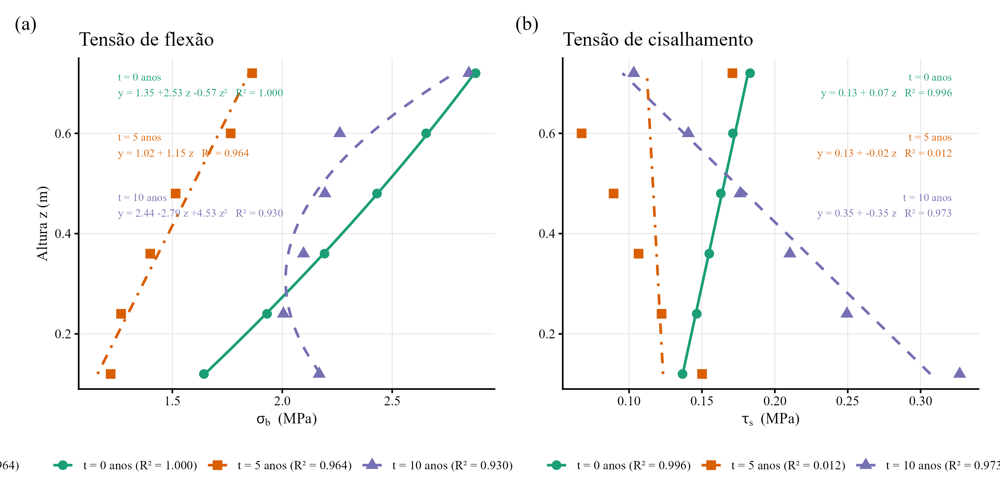

# Resumo

Paliçadas de *Bambusa vulgaris* são adotadas como estruturas de bioengenharia de solos para controle de ravinas em regiões tropicais, porém a evolução temporal de sua integridade estrutural sob biodegradação acoplada ao carregamento hidrossedimentológico progressivo não foi quantificada. Avaliamos a adequação mecânica de paliçadas de *Bambusa vulgaris* ao longo de 10 anos mediante modelo tridimensional de elementos finitos (vigas de Euler-Bernoulli, 12 DOF, critério de Tsai-Hill) aplicado a três segmentos de campo (1,50 a 3,00 m de largura, 0,36 a 0,76 m de altura) instalados sobre Plintossolo Argilúvico no Nordeste do Brasil, combinando três taxas de degradação ($k = 0{,}03$ a $0{,}10$ ano$^{-1}$), três cenários hidrológicos (mediano a P95) e 21 passos de tempo, totalizando 567 combinações. O índice de Tsai-Hill permaneceu inferior a 1,0 nas 567 combinações; sob degradação pessimista a $t = 10$ anos, as estacas verticais consumiram 87\% da capacidade resistente residual, enquanto os colmos horizontais operaram abaixo de 2\%. O cisalhamento interlaminar nas zonas de nó de entrenó respondeu por 97,5\% do índice de falha no elemento crítico, com amplificação de 250\% nas junções colmo-estaca. Sob taxa de degradação de referência ($k = 0{,}06$ ano$^{-1}$), o fator de segurança mínimo foi 2,5 em todos os segmentos ao longo dos 10 anos. A capacidade de armazenamento sedimentar atingiu 100% entre 1,0 e 4,8 anos em todos os cenários, sempre antes da falha mecânica, com os três cenários hidrológicos convergindo para o mesmo índice de falha após a saturação sedimentar. Os resultados indicam que o desassoreamento periódico, e não o reforço estrutural, pode ser a intervenção com maior impacto sobre a longevidade funcional das paliçadas de bambu como estruturas de bioengenharia de solos.

**Palavras-chave:** bioengenharia de solos; longevidade funcional; barreiras permeáveis; cisalhamento interlaminar; erosão em ravinas; integridade estrutural.

# 1. Introdução

O controle de erosão linear por barreiras permeáveis vegetais (*check dams*) fundamenta-se no princípio de redução da velocidade e da energia do escoamento concentrado, promovendo deposição de sedimentos a montante e estabilização progressiva do canal [@piton_et_al_2017; @bombino_et_al_2019]. Em sistemas de bioengenharia tropical, o *Bambusa vulgaris* é empregado por combinar resistência mecânica inicial elevada (120 a 230 MPa de resistência à tração), disponibilidade local abrangente e capacidade de brotamento quando enterrado parcialmente no solo [@huzita_noda_kayo_2020; @birnnaum_et_al_2018].

A eficácia operacional dessas estruturas é, contudo, condicionada pela interação entre a degradação biológica do material construtivo, mediada por ataque fúngico, hidrólise e ação de insetos em contato direto com solo úmido, com perda de até 50% da resistência mecânica em cinco anos para bambu não tratado [@ghimire_et_al_2013], e o preenchimento progressivo da capacidade de armazenamento a montante, cuja taxa depende do regime pluviométrico e da eficiência de retenção.

Estudos sobre *check dams* em ravinas têm se concentrado predominantemente na eficiência de retenção de sedimentos e na evolução geomorfológica do canal [@wang_et_al_2021; @xu_fu_he_2013], enquanto a integridade estrutural do material ao longo do tempo sob solicitações mecânicas reais permanece pouco investigada. Em particular, a identificação dos pontos críticos de concentração de tensão em toras de bambu, com comportamento ortotrópico e zonas de fragilidade nos nós de entrenó, não foi abordada no contexto de bioengenharia de solos.

A análise por elementos finitos (FEM) permite espacializar o campo de tensões em uma estrutura submetida a carregamentos variáveis no tempo e identificar os modos de falha dominantes (flexão, cisalhamento interlaminar, flambagem) e sua localização ao longo da tora [@romano_et_al_2016]. A aplicação de critérios de falha para materiais ortotrópicos, como o índice de Tsai-Hill, possibilita quantificar a proximidade da ruptura em cada ponto da malha a cada instante de tempo, integrando a degradação das propriedades mecânicas e o incremento progressivo do carregamento.

Este estudo avalia a integridade mecânica de paliçadas de *Bambusa vulgaris* ao longo de 10 anos, identificando os modos de falha dominantes, os elementos críticos e a relação temporal entre segurança estrutural e preenchimento sedimentar. A hipótese central é que a capacidade de armazenamento sedimentar tende a atingir saturação antes da falha mecânica, tornando o desassoreamento periódico, e não o reforço estrutural, a intervenção com maior impacto sobre a longevidade funcional da estrutura.

# 2. Materiais e métodos

## 2.1 Sistema experimental e dados de entrada

Quatro paliçadas de *Bambusa vulgaris* (P1 a P4) foram instaladas em série ao longo de uma ravina desenvolvida sobre Plintossolo Argilúvico distrófico, na Estação Experimental Campus Rural da Universidade Federal de Sergipe, em São Cristóvão, SE (10°55'28,8" S; 37°11'58,9" O). O espaçamento entre estruturas foi definido de modo que a base de cada paliçada ficasse em nível com o topo da seguinte a jusante, maximizando o volume de retenção no desnível formado [@emater_2006; @couto_et_al_2010]. A ravina foi segmentada em três trechos funcionais com alturas úteis de armazenamento de 50 cm (segmento superior, SUP), 76 cm (intermediário, MED) e 36 cm (inferior, INF).

A construção da estrutura consistiu na cravação de estacas verticais de bambu a 30 cm de profundidade no leito da ravina, seguida pela fixação de colmos horizontais (longarinas) às estacas mediante amarração com arame recozido (Fig. 1). Cada colmo horizontal recebeu 15 cm de comprimento adicional em cada extremidade, possibilitando o embutimento nos taludes laterais e conferindo confinamento lateral ao conjunto. A tora basal foi incorporada após dois meses de enterramento prévio, período que permitiu o desenvolvimento de brotos a partir dos entrenós perfurados e preenchidos com água [@Mira_Evette_2021], com dupla função de propagação vegetativa e barreira contra enxurradas. Para aumentar a eficiência de retenção, sacos de ráfia preenchidos com solo local ou vazios foram fixados na face a montante das paliçadas [@nardin_et_al_2010]. A integridade estrutural do conjunto foi mantida por intervenções periódicas em ciclo de oito meses, com substituição de arames recozidos e renovação dos sacos de ráfia, procedimento voltado a preservar a capacidade de retenção sem bloquear o escoamento nem elevar o risco de colapso do depósito sob eventos de alta energia.

{width="6.5in"}

O monitoramento de deposição sedimentar empregou pinos de ferro com 30 cm de comprimento cravados a 10 cm de profundidade (20 cm expostos), espaçados em intervalos regulares de 1 m ao longo dos três segmentos. As leituras foram realizadas mensalmente durante dois anos (2023–2025) com régua graduada (precisão de 1 mm), registrando a altura exposta como proxy da deposição acumulada a montante [@morgan_2005]. As eficiências de retenção por segmento ($1{,}12$ a $1{,}97 \times 10^{-4}$ cm/mm) foram derivadas dessas medições, enquanto os dados pluviométricos da estação meteorológica de Aracaju-SE (série diária de 20 anos, 2005–2025) definiram os limiares P90 (168,1 mm/mês) e P95 (181,8 mm/mês).

{width="6.5in"}

## 2.2 Modelo geométrico e discretização em elementos finitos

A paliçada foi representada como um pórtico espacial (*space frame*) composto por colmos horizontais empilhados (longarinas) conectados a estacas verticais cravadas no solo (Figura 3). Cada elemento foi modelado como viga tridimensional de Euler-Bernoulli com 12 graus de liberdade por elemento (6 DOF por nó: três translações e três rotações), seção tubular oca (diâmetro externo 100 mm, diâmetro interno 70 mm, espessura de parede inicial 15 mm), e propriedades ortotrópicas do *Bambusa vulgaris* (Tabela 1).

A geometria paramétrica distingue os três segmentos de campo, INF (largura 1,50 m, altura 0,36 m), MED (largura 3,00 m, altura 0,76 m) e SUP (largura 1,90 m, altura 0,50 m). As estacas foram posicionadas com espaçamento máximo de 1,50 m (2 a 3 estacas por segmento). Embora a profundidade de cravação em campo seja de 30 cm, o modelo estende cada estaca 0,70 m abaixo do nível do solo para garantir que a condição de engaste total (6 DOF fixos na extremidade inferior) reproduza o confinamento lateral oferecido pelo Plintossolo sem impor rigidez artificial imediatamente na superfície, permitindo que os elementos embebidos desenvolvam momento fletor e cisalhamento ao longo da zona de transição solo-estrutura.

Os colmos horizontais foram dispostos com espaçamento vertical de 0,12 m, totalizando 3 a 6 camadas por segmento conforme a altura útil. O embutimento lateral dos colmos nos taludes (15 cm por extremidade) não foi representado no modelo, de modo que a largura do vão livre corresponde à distância entre estacas. Cada vão de colmo entre estacas consecutivas foi subdividido em quatro elementos, gerando 19 a 60 nós e 20 a 69 elementos por segmento (114 a 360 DOF). As conexões colmo-estaca foram modeladas como junções rígidas (todos os DOF compartilhados no nó de interseção), simplificação da amarração por arame recozido executada em campo, cuja rigidez rotacional finita é discutida adiante.

A matriz de rigidez local de cada elemento (12×12) foi montada pela formulação de Przemieniecki para vigas de Euler-Bernoulli em espaço tridimensional, incluindo rigidez axial, flexão em dois planos ortogonais e torção. A transformação de coordenadas locais para globais empregou a matriz de rotação $\boldsymbol{\Lambda}$ (3×3), expandida em bloco diagonal para 12×12, com eixo local $x$ orientado ao longo do elemento e eixo auxiliar $z$ vertical para elementos horizontais ou $x$ global para elementos verticais. As condições de contorno foram definidas como engaste total (todos os 6 DOF fixos) nos nós das pontas enterradas das estacas, liberando os demais nós para simular a rigidez finita do trecho embebido no solo por meio da deformabilidade do próprio elemento de viga.

## 2.3 Propriedades do material e modelo de degradação

O *Bambusa vulgaris* foi tratado como material ortotrópico com propriedades mecânicas iniciais ($t = 0$) obtidas da literatura especializada (Tabela 1). O módulo de elasticidade longitudinal (12 GPa), a resistência à tração (180 MPa) e a resistência ao cisalhamento interlaminar (10 MPa) representam a faixa superior de valores reportados para a espécie em condições de colheita madura e sem tratamento preservativo [@huzita_noda_kayo_2020; @ghimire_et_al_2013].

**Tabela 1** -- Propriedades mecânicas iniciais do *Bambusa vulgaris* adotadas no modelo FEM.

| Propriedade | Símbolo | Valor | Unidade |
|---|---|---|---|
| Módulo de elasticidade longitudinal | $E_L$ | 12,0 | GPa |
| Módulo de elasticidade radial | $E_R$ | 1,0 | GPa |
| Resistência à tração longitudinal | $\sigma_{tL}$ | 180 | MPa |
| Resistência à compressão longitudinal | $\sigma_{cL}$ | 60 | MPa |
| Resistência ao cisalhamento interlaminar | $\tau_{LR}$ | 10 | MPa |
| Coeficiente de Poisson | $\nu_{LR}$ | 0,32 | — |
| Densidade | $\rho$ | 680 | kg/m³ |

A degradação temporal de todas as propriedades mecânicas foi modelada por decaimento exponencial (Equação 1), com três cenários de taxa de degradação anual.

| $\displaystyle P(t) = P_0 \cdot e^{-k \cdot t}$ | (1) |
| --- | --- |

Na Equação 1, $P(t)$ é qualquer propriedade mecânica no tempo $t$ (anos), $P_0$ é o valor inicial e $k$ é a taxa de decaimento. Os cenários otimista ($k = 0{,}03$ ano$^{-1}$), referência ($k = 0{,}06$ ano$^{-1}$) e pessimista ($k = 0{,}10$ ano$^{-1}$) cobrem a faixa de durabilidade reportada para bambu não tratado em ambiente tropical úmido.

As zonas de nó de entrenó foram parametrizadas com fator de redução de 0,65 sobre a resistência ao cisalhamento interlaminar (6,5 MPa em $t = 0$), refletindo a descontinuidade microestrutural do diafragma, onde as fibras longitudinais convergem e a resistência à delaminação é inferior à da região internodal [@ghimire_et_al_2013].

## 2.4 Modelo de carregamento

O carregamento sobre o pórtico tridimensional combina cinco componentes laterais (direção perpendicular ao plano da paliçada) e uma componente gravitacional, todas variáveis no tempo conforme o preenchimento sedimentar progride.

Na face a montante, abaixo do nível de sedimento, atua o empuxo ativo ($p_{sed}(z,t) = \gamma_s \cdot K_a \cdot (h_{sed}(t) - z)$, com $K_a = 0{,}333$ e $\gamma_s = 15\,000$ N/m³), convertido em carga distribuída por unidade de comprimento ao longo do diâmetro externo de cada colmo. Colmos submersos acima do nível de sedimento recebem adicionalmente a pressão hidrostática ($p_w = \rho_w \cdot g \cdot (h_w - z)$), ao passo que os colmos expostos são solicitados pelo arrasto hidrodinâmico ($q_d = \tfrac{1}{2} C_d \rho_w v^2 D_{ext}$, $C_d = 1{,}2$) e pelo impacto de detritos (400 N para P95, distribuído como pressão uniforme sobre a face exposta $h_{exp} \times L$). O peso próprio ($\rho \cdot A \cdot g$) completa o carregamento como carga gravitacional em todos os elementos.

Todas as cargas distribuídas foram transformadas de coordenadas globais para locais de cada elemento mediante a matriz de rotação $\boldsymbol{\Lambda}$, e as forças nodais equivalentes foram obtidas pela formulação de cargas consistentes do elemento de viga de Euler-Bernoulli (forças transversais $qL/2$ e momentos $\pm qL^2/12$ por componente), transformadas de volta ao sistema global via $\mathbf{T}^T \mathbf{f}_{local}$ e montadas no vetor de forças global. A carga de arrasto e impacto foi escalonada pelo fator logístico de vegetação (Equação 2), que modela a colonização progressiva da face a montante por material vegetal.

| $\displaystyle f_{veg}(t) = 1 - V_{max} \cdot \frac{1}{1 + e^{-r\,(t - t_m)}}$ | (2) |
| --- | --- |

Na Equação 2, $V_{max} = 0{,}30$ é a redução máxima de carga (30%), $r = 2{,}0$ ano$^{-1}$ é a taxa de crescimento logístico e $t_m = 2{,}0$ anos é o ponto de inflexão da curva sigmoide, de modo que o fator reduz progressivamente até 30\% da carga efetiva de arrasto e impacto a partir do 2.º ano.

**Tabela 2** -- Tempo estimado até preenchimento pleno (100%) da capacidade de armazenamento por segmento e cenário hidrológico, derivado das eficiências de retenção empíricas ($1{,}12$ a $1{,}97 \times 10^{-4}$ cm/mm) e da série pluviométrica de 20 anos (2005–2025).

| Segmento | $H$ (cm) | Mediano (anos) | P90 (anos) | P95 (anos) |
|----------|----------:|---------------:|-----------:|-----------:|
| SUP      |        50 |            4,8 |        2,4 |        2,2 |
| MED      |        76 |            2,2 |        1,1 |        1,0 |
| INF      |        36 |            1,7 |        0,8 |        0,8 |

*Nota: A progressão do preenchimento foi parametrizada como linear entre 0% em $t = 0$ e 100% no tempo de saturação ($T_{sat}$), com o percentual em qualquer instante dado por $\min(100,\; t/T_{sat} \times 100)$. Os tempos de saturação derivam da projeção das taxas de deposição mensal,  sob recorrência contínua do regime hidrológico de cada cenário, sobre a altura útil remanescente de cada segmento.*

## 2.5 Critério de falha e análise dos modos de ruptura

O critério de Tsai-Hill para materiais ortotrópicos (Equação 3) foi adotado para quantificar a proximidade da ruptura em cada elemento a cada passo de tempo.

| $\displaystyle FI = \left(\frac{\sigma_b}{\sigma_{ult}}\right)^2 + \left(\frac{\tau_s}{\tau_{ult}}\right)^2$ | (3) |
| --- | --- |

Na Equação 3, $\sigma_b$ é a tensão combinada de flexão ($\sqrt{M_y^2 + M_z^2} \cdot c / I$), $\tau_s$ é a tensão de cisalhamento resultante ($\sqrt{V_y^2 + V_z^2} \cdot Q_{max} / (2It)$), $\sigma_{ult}(t)$ e $\tau_{ult}(t)$ são as resistências degradadas. Valores de $FI \geq 1{,}0$ indicam falha. As forças internas em cada elemento foram extraídas em coordenadas locais pela expressão $\mathbf{f}_{local} = \mathbf{k}_e \cdot \mathbf{T} \cdot \mathbf{U}_{global}$, e os valores máximos de momento e cortante entre os dois nós do elemento definiram as tensões de projeto.

Um fator de concentração de tensão (SCF = 1,8) foi aplicado às tensões nos elementos de colmo adjacentes às junções colmo-estaca e nos elementos de estaca entre camadas, representando a amplificação local decorrente da descontinuidade geométrica (nó de entrenó do bambu e ponto de amarração). As zonas de nó receberam, adicionalmente, o fator de redução de 0,65 sobre a resistência ao cisalhamento interlaminar (6,5 MPa em $t = 0$).

A simulação totalizou 567 combinações (3 segmentos $\times$ 3 cenários hidrológicos $\times$ 3 taxas de degradação $\times$ 21 passos de tempo de 0 a 10 anos em intervalos de 0,5 ano), com montagem e solução do sistema global ($\mathbf{K}\mathbf{U} = \mathbf{F}$) por inversão direta (matrizes densas, até 360 DOF), otimizada pela reutilização da matriz de rigidez para cenários hidrológicos distintos sob mesma degradação e tempo.

A distribuição vertical das tensões máximas ($\sigma_b$ e $\tau_s$) ao longo da altura do segmento MED foi modelada por regressão, comparando-se ajuste linear ($y = \beta_0 + \beta_1 z$) e polinomial de segundo grau ($y = \beta_0 + \beta_1 z + \beta_2 z^2$) para cada instante temporal (0, 5 e 10 anos). A seleção do modelo adotou o teste F incremental (ANOVA sequencial), retendo o modelo quadrático quando $p < 0{,}05$; caso contrário, o modelo linear mais parcimonioso foi mantido. Os ajustes foram realizados em R 4.5.1 e os resultados expressos pelos coeficientes $\beta_i$, pelo coeficiente de determinação $R^2$ e pelo valor-$p$ do teste F global do modelo.

# 3. Resultados e discussão

## 3.1 Resposta estrutural global

O índice de Tsai-Hill permaneceu inferior a 1,0 em todas as 567 combinações avaliadas, indicando que nenhuma configuração de segmento, cenário hidrológico ou taxa de degradação conduziu à ruptura mecânica da estrutura ao longo de 10 anos. A configuração deformada do segmento MED sob degradação pessimista ($k = 0{,}10$ ano$^{-1}$, $t = 10$ anos) concentra os maiores índices de falha nos elementos de estaca próximos às junções colmo-estaca, com FI$_{max} = 0{,}87$ (FS = 1,1), enquanto os colmos horizontais permanecem com FI inferior a 0,02 (Fig. 3b). Essa distribuição espacial de vulnerabilidade é consistente com o papel estrutural das estacas como elementos de transferência de carga no pórtico.

{width="6.5in"}

Sob degradação de referência ($k = 0{,}06$ ano$^{-1}$), o fator de segurança mínimo da estrutura foi 2,5 (FI = 0,39, MED, $t = 10$ anos, Fig. 4), valor compatível com margens de projeto de estruturas provisórias de bioengenharia [@romano_et_al_2016] e com a ausência de rupturas observadas em dois anos de monitoramento de campo. A seleção de modelos por AIC indicou crescimento exponencial como melhor ajuste para o cenário pessimista sob P95 ($FI = 0{,}0066 \cdot e^{0{,}485 \cdot t}$, $R^2 = 0{,}983$) e para todos os cenários sob regime hidrológico mediano ($R^2 \geq 0{,}997$), ao passo que os cenários otimista e de referência sob P95 apresentaram trajetória quadrática ($R^2 = 0{,}962$ e $0{,}956$, respectivamente), com vale inicial entre $t = 2$ e 4 anos seguido de aceleração progressiva. No cenário otimista ($k = 0{,}03$ ano$^{-1}$), o FS manteve-se acima de 4,6 para o segmento MED a $t = 10$ anos, sugerindo que tratamentos preservativos capazes de reduzir a taxa de degradação para valores próximos a 0,03 ano$^{-1}$ podem estender a vida útil estrutural.

{width="6.5in"}

O segmento MED apresentou FI 19 a 38 vezes superior aos segmentos INF e SUP, cuja resposta manteve FS acima de 22 em todas as combinações. INF (L = 1,50 m, H = 0,36 m) registrou FI$_{max} = 0{,}023$ (FS = 43) a $t = 8{,}5$ anos, ao passo que SUP (L = 1,90 m, H = 0,50 m) atingiu FI$_{max} = 0{,}045$ (FS = 22) a $t = 10$ anos, ambos sob degradação pessimista (Fig. 5). A evolução temporal do fator de segurança seguiu trajetória quadrática no MED ($FS = 20{,}01 - 0{,}60 \cdot t - 0{,}163 \cdot t^2$, $R^2 = 0{,}804$) e no SUP ($FS = 483{,}97 - 79{,}77 \cdot t + 3{,}36 \cdot t^2$, $R^2 = 1{,}000$), indicando aceleração da perda de capacidade resistente a partir do quinto ano, enquanto o INF manteve platô ($FS \approx 49{,}7$) ao longo dos 10 anos avaliados. A dominância do segmento MED decorre da combinação de maior largura (3,00 m, três estacas espaçadas 1,50 m) com seis camadas de colmos (alturas de 0,12 a 0,72 m), gerando momentos fletores na base das estacas proporcionais à superposição das reações horizontais de cada camada.

## 3.2 Estacas como elementos críticos

As estacas verticais concentraram índices de falha 45 vezes superiores aos dos colmos horizontais no cenário mais adverso (FI$_{max,estaca}$ = 0,87 *vs.* FI$_{max,colmo}$ = 0,02), contraste que se reproduz nos demais segmentos (FI$_{max,estaca}$ = 0,023 em INF e 0,045 em SUP, contra FI$_{max,colmo}$ < 0,002 em ambos). Esse contraste indica que o pórtico opera com os colmos como longarinas de baixa solicitação e as estacas como consoles engastados no solo, acumulando as reações horizontais de todas as camadas de colmo. Para o segmento MED, cada estaca deve resistir à superposição das seis reações laterais multiplicadas pelas respectivas alturas ($M_{base} = \sum R_i \cdot (z_i + h_{emb})$), o que gera momentos de 15 a 25 vezes superiores ao momento máximo em um colmo isolado.

{width="6.5in"}

Os colmos apresentaram FI inferior a 0,02 mesmo sob degradação severa ($k = 0{,}10$ ano$^{-1}$, $t = 10$ anos), já que os vãos entre estacas (0,75 a 1,50 m) são curtos o suficiente para manter tensões de flexão e cisalhamento abaixo de 3 MPa e 0,35 MPa, respectivamente. O baixo nível de solicitação nos colmos sugere que o dimensionamento de paliçadas de bambu pode priorizar a seção e a profundidade de cravação das estacas sem necessidade de ampliar o diâmetro dos colmos horizontais, critério distinto do dimensionamento convencional de *check dams* de concreto ou gabião, nos quais a estabilidade depende da massa e do atrito na base [@piton_et_al_2017]. A profundidade de cravação adotada em campo (30 cm) é suficiente para garantir confinamento lateral no Plintossolo Argilúvico, cuja elevada fração argilosa no horizonte Bt (40–150+ cm) favorece resistência passiva à extração; contudo, profundidades superiores a 50 cm podem ampliar a margem de segurança nas estacas do segmento MED, onde o momento na base consome 87\% da capacidade resistente no cenário pessimista.

## 3.3 Concentração de tensão nas junções e modo de falha dominante

As zonas de junção colmo-estaca (nós de entrenó) apresentaram FI 3,5 vezes superior ao das zonas internodais, como consequência da amplificação simultânea das tensões pelo fator de concentração (SCF = 1,8) e da redução da resistência ao cisalhamento interlaminar (fator 0,65, $\tau_{ult} = 6{,}5$ MPa em $t = 0$). Essa redução é consistente com o padrão reportado por @meng_et_al_2023, que identificaram queda de 20 a 50% na resistência à tração e ao cisalhamento nas seções nodais de colmos de bambu em relação às zonas internodais, atribuída à convergência das fibras longitudinais no diafragma e à descontinuidade microestrutural resultante. @shao_et_al_2010, ao compararem seções nodais e internodais de *Phyllostachys edulis*, observaram que a resistência ao cisalhamento interlaminar nas regiões de nó pode ser inferior em até 35% à das zonas internodais, valor próximo ao fator de 0,65 adotado neste modelo. 

O cisalhamento interlaminar constitui o modo de falha dominante nas estacas, respondendo por 97,5% do índice de Tsai-Hill no elemento crítico ($FI_{cis} = 0{,}85$, $FI_{flex} = 0{,}02$, MED, $t = 10$ anos), resultado análogo ao obtido por @ramful_2022 em simulações por elementos finitos de colmos submetidos a carregamento transversal, nas quais a fratura interlaminar paralela à fibra predominou sobre a ruptura por flexão em razão da concentração de tensão cisalhante na interface entre lamelas. A tensão de cisalhamento na estaca crítica ($\tau_s = 2{,}21$ MPa após SCF) consome 93% da resistência residual degradada nas zonas nodais ($\tau_{ult} = 2{,}39$ MPa a $t = 10$, $k = 0{,}10$ ano$^{-1}$), ao passo que a tensão de flexão ($\sigma_b = 9{,}84$ MPa) consome apenas 15% da resistência residual à tração ($\sigma_{ult} = 66{,}2$ MPa). @he_et_al_2024 também verificaram que a ruptura por cisalhamento paralelo às fibras em *Phyllostachys edulis* ocorre a níveis de tensão significativamente inferiores aos de ruptura por flexão, o que corrobora a dominância do modo cisalhante observada neste estudo.

A distribuição vertical de tensões ao longo da altura do segmento MED (Fig. 6) acompanha o perfil de empuxo ativo do sedimento retido ($p_{sed} \propto (h_{sed} - z)$), padrão coerente com a distribuição triangular de pressão lateral prevista pela teoria de Rankine para material granular retido a montante de barreiras permeáveis [@piton_et_al_2017]. Em $t = 0$ anos, a tensão de flexão apresentou gradiente linear positivo com a altura ($\sigma_b = 1{,}35 + 2{,}53z - 0{,}57z^2$, $R^2 = 0{,}9999$, $p < 0{,}001$), sendo o termo quadrático significativo pelo teste F incremental ($F_{1,3} = 52{,}6$, $p = 0{,}005$), enquanto o cisalhamento seguiu modelo linear ($\tau_s = 0{,}128 + 0{,}075z$, $R^2 = 0{,}996$, $p < 0{,}001$).

Aos 5 anos, ambas as distribuições mantiveram ajuste linear ($\sigma_b$: $R^2 = 0{,}964$, $\beta_1 = 1{,}15$ MPa m$^{-1}$; $\tau_s$: $R^2 = 0{,}012$, $p = 0{,}84$), indicando perda de gradiente vertical de cisalhamento à medida que o preenchimento sedimentar uniformiza o carregamento lateral. A homogeneização da solicitação é consistente com o mecanismo de retroalimentação entre forma da feição e eficiência de retenção descrito por @Chen_2024, segundo o qual o preenchimento progressivo redistribui o empuxo de pressão trapezoidal à medida que o depósito a montante substitui a lâmina de escoamento por massa sedimentar estática. Em $t = 10$ anos, a degradação diferencial das propriedades mecânicas restabeleceu curvatura na distribuição de flexão ($\sigma_b = 2{,}44 - 2{,}79z + 4{,}53z^2$, $R^2 = 0{,}930$, $F_{1,3} = 15{,}1$, $p = 0{,}030$), com valores entre 2,0 e 2,8 MPa, ao passo que o cisalhamento exibiu gradiente negativo pronunciado ($\tau_s = 0{,}349 - 0{,}352z$, $R^2 = 0{,}974$, $p < 0{,}001$), decrescendo de 0,33 MPa na camada inferior ($z = 0{,}12$ m) a 0,10 MPa na camada superior ($z = 0{,}72$ m). A inversão do gradiente de cisalhamento entre $t = 0$ (crescente com $z$) e $t = 10$ anos (decrescente com $z$) reflete a transição do carregamento dominante de arrasto hidrodinâmico para empuxo ativo sedimentar, fenômeno análogo à mudança de regime de solicitação documentada por @wang_et_al_2021 em *check dams* após a fase de colmatação.

{width="6.5in"}

A assimetria entre as resistências do *Bambusa vulgaris* (relação $\sigma_{tL}/\tau_{LR} = 18$) explica a dominância do cisalhamento interlaminar, pois tensões de cisalhamento de magnitude moderada produzem contribuições proporcionalmente maiores ao índice de Tsai-Hill que tensões de flexão da mesma ordem, assim como observado por @taylor_et_al_2015, que indicaram que a anisotropia mecânica do bambu concentra a vulnerabilidade nas interfaces entre lamelas, onde o cisalhamento interlaminar governa a iniciação de trincas mesmo sob carregamentos predominantemente de flexão. A concentração preferencial de tensão nos nós (Fig. 7) corrobora observações de delaminação nodal como mecanismo primário de degradação em bambu exposto a intempéries [@ghimire_et_al_2013], sugerindo que o reforço localizado nas junções por arame ou abraçadeiras pode ser mais eficaz que o aumento de diâmetro dos colmos. Essa orientação é consistente com @tardio_mickovski_2017, que, para estruturas de bambu em bioengenharia de solos, indicaram maior relação custo-eficácia do reforço pontual das conexões em comparação ao aumento da seção transversal dos elementos. 

Na prática construtiva adotada, a amarração por arame recozido constitui a única conexão mecânica entre colmos e estacas, e sua substituição periódica a cada oito meses visa preservar a rigidez rotacional da junção frente à corrosão e ao afrouxamento progressivo. A modelagem como junta rígida representa, portanto, a condição imediatamente após a manutenção; entre ciclos de substituição, a perda parcial de rigidez rotacional tenderia a redistribuir momento das estacas para os colmos, possivelmente reduzindo o FI nas zonas nodais das estacas e elevando-o nos colmos, embora estes operem com margem superior a 98% de capacidade remanescente.

## 3.4 Evolução temporal e interação degradação–carregamento

O índice de falha no segmento MED apresentou crescimento monotônico a partir de $t \approx 5$ anos (Fig. 4), acelerando entre o 8.º e o 10.º ano quando a degradação pessimista reduziu as propriedades mecânicas para 37% dos valores iniciais ($e^{-0{,}10 \times 10} = 0{,}37$) e a espessura de parede diminuiu de 15 para 5 mm. Sob esse cenário, o FI atingiu 0,30 a $t = 8$ anos e 0,87 a $t = 10$ anos, ao passo que o cenário de referência acumulou FI = 0,16 e 0,39 nos mesmos instantes e o cenário otimista não ultrapassou FI = 0,22 em 10 anos, evidenciando que a taxa de degradação controla a trajetória de falha de modo mais determinante que o regime hidrológico. A decomposição por zona estrutural (Fig. 7) indicou que tanto o FI nodal quanto o internodal seguiram crescimento exponencial ao longo dos 10 anos ($FI_{nodal} = 0{,}0066 \cdot e^{0{,}485 \cdot t}$, $R^2 = 0{,}983$; $FI_{inter} = 0{,}0029 \cdot e^{0{,}440 \cdot t}$, $R^2 = 0{,}961$), com constante de tempo 10% superior nas zonas nodais, resultado consistente com a redução de resistência interlaminar no diafragma. A razão de concentração nodal/internodal apresentou tendência linear crescente ($Razão = 2{,}24 + 0{,}139 \cdot t$, $R^2 = 0{,}951$), partindo de 2,3 em $t = 0$ e atingindo 3,5 a $t = 10$ anos, o que sugere amplificação progressiva da vulnerabilidade diferencial nos nós de entrenó à medida que a degradação avança.

{width="6.5in"}

Os três cenários hidrológicos (mediano, P90, P95) convergem para o mesmo FI após o preenchimento sedimentar atingir 100% em cada segmento (Tabela 2), permanecendo idênticos até $t = 10$ anos. Essa convergência ocorre porque, uma vez atingida a saturação da capacidade de armazenamento, as cargas de arrasto e impacto de detritos tornam-se nulas (altura exposta inferior ao espaçamento vertical) e o empuxo ativo de sedimentos, independente do regime hidrológico, passa a ser o único carregamento lateral. Para o segmento MED, a convergência ocorre a partir de $t \approx 2{,}2$ anos (cenário mediano), ao passo que sob P95 todos os segmentos atingem preenchimento pleno em menos de 2,2 anos. Esse comportamento sugere que, para horizontes de projeto superiores ao tempo de saturação, a taxa de degradação do material é o fator de controle primário da segurança estrutural, enquanto a severidade pluviométrica condiciona a resposta apenas nos anos iniciais. A dominância do preenchimento sedimentar sobre o comportamento de longo prazo reproduz o padrão de saturação funcional reportado para *check dams* em ravinas [@wang_et_al_2021; @ramos_diez_et_al_2017], embora nesses sistemas a saturação não esteja geralmente acoplada à degradação progressiva do material construtivo.

## 3.5 Deslocamento lateral e implicações para manutenção

O deslocamento lateral máximo no topo da estaca atingiu 55,8 mm no segmento MED a $t = 10$ anos sob degradação pessimista (Fig. 8), correspondendo a 56% do diâmetro externo dos colmos (100 mm). INF e SUP registraram deslocamentos de 3,8 e 9,0 mm nos mesmos cenários, compatíveis com deformações de serviço. Sob degradação de referência, o deslocamento no MED a $t = 10$ foi de 37,4 mm, valor que não compromete a funcionalidade da vedação entre colmos adjacentes. Embora normas de projeto estrutural para edificações limitem deslocamentos laterais a L/150 a L/300 do vão livre, estruturas de bioengenharia de solos operam sob critérios de estado limite de serviço mais tolerantes, nos quais a funcionalidade hidráulica (permeabilidade controlada e retenção de sedimentos) prevalece sobre a rigidez geométrica [@tardio_mickovski_2017; @acharya_2018]. Nesse contexto, o deslocamento de 55,8 mm no cenário pessimista pode comprometer a sobreposição entre colmos adjacentes quando o espaçamento vertical (120 mm) é da mesma ordem de grandeza do deslocamento diferencial entre camadas, ao passo que o valor de 37,4 mm sob degradação de referência preserva a funcionalidade da estrutura ao longo de todo o horizonte de 10 anos.

{width="6.5in"}

A falha funcional por saturação sedimentar (100% da capacidade entre $t = 1{,}0$ e 4,8 anos conforme segmento e cenário, Tabela 2) precede a ruptura mecânica em todas as 567 combinações avaliadas, mesmo no cenário mais adverso ($FI = 0{,}87$, FS = 1,1), indicando que a paliçada permanece estruturalmente íntegra quando já perdeu sua capacidade de retenção. Esse descompasso entre falha funcional e falha mecânica reproduz o padrão observado em revisões globais de técnicas de controle de erosão linear, nas quais a saturação sedimentar é identificada como a principal causa de perda de eficácia de *check dams*, ao passo que a degradação estrutural raramente constitui o mecanismo de falha primário [@frankl_et_al_2021]. O protocolo de manutenção adotado em campo, cujo ciclo de oito meses contempla a substituição de arames recozidos e a renovação de sacos de ráfia na face a montante, é coerente com essa hierarquia de falhas, embora não inclua desassoreamento.

A simulação sugere que a incorporação de desassoreamento parcial ao protocolo existente pode estender a vida útil funcional do sistema sem comprometer a integridade estrutural, critério coerente com a experiência operacional de *check dams* de madeira e bambu em restauração de ravinas [@bombino_et_al_2019; @nichols_polyakov_2019]. Inspeções de integridade estrutural podem ser direcionadas às junções colmo-estaca, onde sinais de delaminação interlaminar constituem o indicador mais precoce de degradação avançada. Os nós de entrenó concentram as maiores reduções de resistência mecânica do bambu, com perdas de até 41% na resistência à tração em relação às zonas internodais [@zhang_li_et_al_2021], e a fissura longitudinal por cisalhamento interlaminar é o modo de falha dominante em elementos solicitados por flexão [@richard_2013]. A tora basal, que desempenha dupla função de barreira e substrato de propagação vegetativa, opera sob as menores tensões da estrutura (camada inferior, FI < 0,01), sugerindo que sua viabilidade como propágulo não é comprometida pelo carregamento mecânico ao longo do horizonte avaliado.

# 4. Conclusões

A paliçada de *Bambusa vulgaris* manteve integridade mecânica ao longo do horizonte de 10 anos avaliado, com o cisalhamento interlaminar nas zonas nodais das estacas como modo de falha dominante e os colmos horizontais operando com margem residual superior a 98%.

A taxa de degradação do material controlou a trajetória de falha de modo mais determinante que o regime hidrológico, dado que os cenários P95, P90 e mediano convergiram para o mesmo índice de falha após a saturação sedimentar, tornando a biodegradação o fator de controle primário da segurança estrutural a médio e longo prazo.

A razão de concentração de tensão entre zonas nodais e internodais apresentou tendência linear crescente ao longo dos 10 anos, sugerindo amplificação progressiva da vulnerabilidade diferencial nos nós de entrenó, o que pode orientar inspeções de campo para sinais de delaminação interlaminar como indicador precoce de degradação avançada.

A saturação sedimentar precedeu a falha mecânica em todos os cenários avaliados, sugerindo que o desassoreamento periódico, e não o reforço estrutural, pode ser a intervenção com maior impacto sobre a longevidade funcional do sistema.

O segmento MED (largura de 3,00 m) respondeu por índices de falha 19 a 38 vezes superiores aos dos segmentos INF e SUP, indicando que paliçadas com vão livre superior a 1,50 m podem exigir estacas com maior seção ou profundidade de cravação para manter margens de segurança compatíveis com horizontes de projeto de 10 anos.

A tora basal operou sob as menores tensões da estrutura ao longo de todo o horizonte avaliado, sugerindo que sua dupla função de barreira e substrato de propagação vegetativa não é comprometida pelo carregamento mecânico.

A validação experimental dos limiares de cisalhamento interlaminar sob degradação de campo e a representação da rigidez rotacional finita das amarrações por arame recozido constituem extensões prioritárias para refinar as estimativas de segurança.

# Declarações

**Disponibilidade de dados e códigos**

Os dados, os scripts em Python (modelo FEM e geração de figuras) e os parâmetros de entrada estão disponíveis no repositório GitHub ldvsantos/palicada.

**Conflito de interesses**

Os autores declaram não haver conflito de interesses.

**Financiamento**

A pesquisa não recebeu financiamento externo.

# Referências

::: {#refs}
:::
