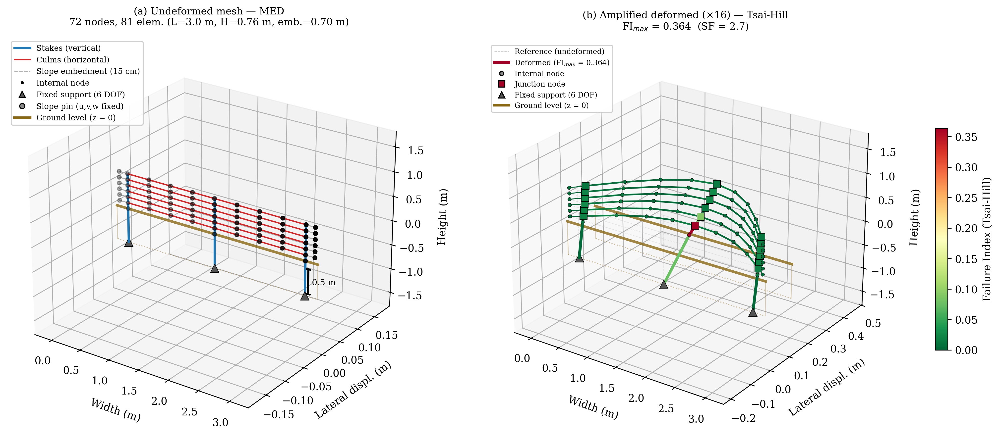
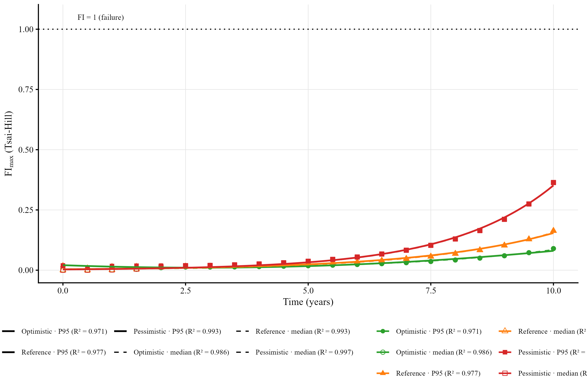
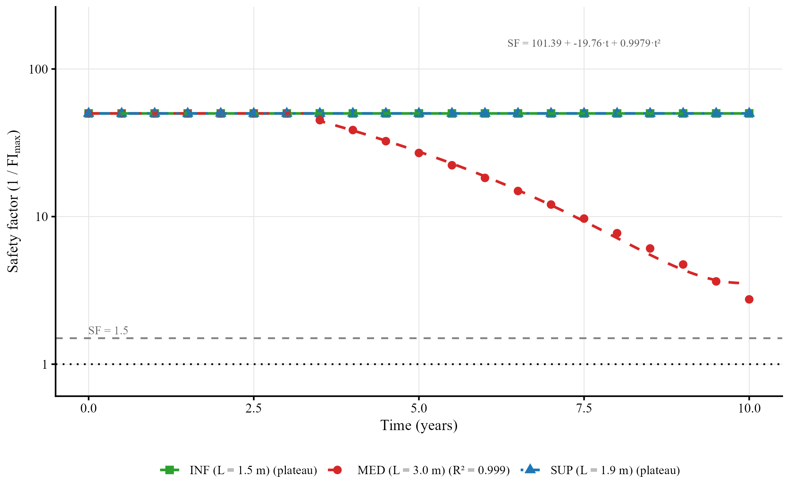
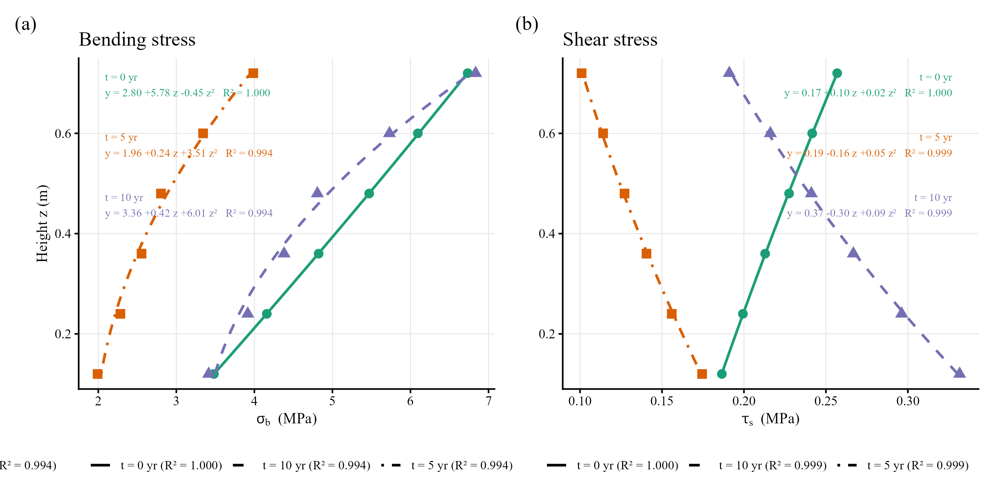
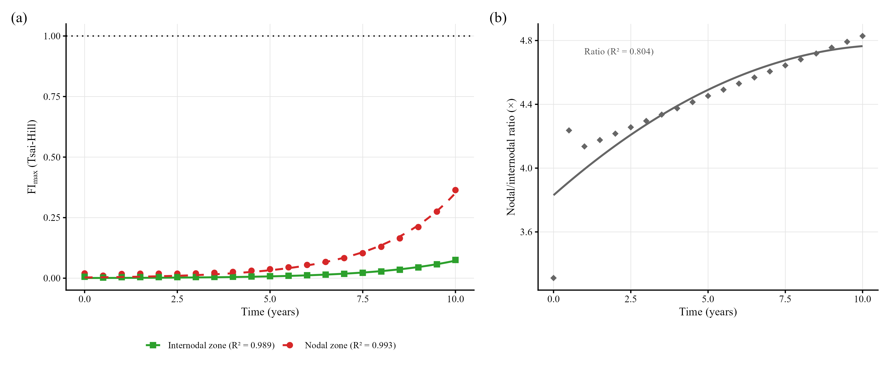
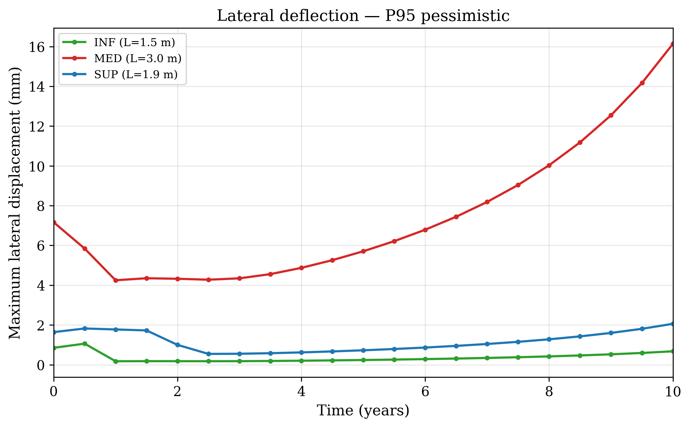

**Luiz Diego Vidal Santos**^1\*^, **Emersson Guedes da Silva**^2^, **Francisco Sandro Rodrigues Holanda**^2^, **Marcos Oliveira Santos**^2^, **Renisson Neponuceno de Araújo Filho**^3^, **Henrique Antonio Silva**^2^, **Mateus Barbosa Santos da Silva**^5^, **Sandro Griza**^4^

^1^ Graduate Program in Territorial Planning, Universidade Estadual de Feira de Santana (UEFS), Feira de Santana, BA, Brazil\
^2^ Department of Agricultural Engineering, Universidade Federal de Sergipe (UFS), São Cristóvão, SE, Brazil\
^3^ Department of Rural Technology, Universidade Federal Rural de Pernambuco (UFRPE), Recife, PE, Brazil\
^4^ Department of Materials Science and Engineering, Universidade Federal de Sergipe (UFS), São Cristóvão, SE, Brazil\
^5^ Universidade Estadual de Feira de Santana (UEFS), Feira de Santana, BA, Brazil

^\*^ Corresponding author: ldvsantos@uefs.br · ORCID: 0000-0001-8659-8557

# Abstract

Bamboo palisades are widely used as permeable check dams for gully erosion control in tropical river basins, yet no quantitative framework exists to predict how material degradation interacts with hydro-sedimentary loading to determine their functional service life. This study evaluates the mechanical integrity of *Bambusa vulgaris* palisades over a 10-year period through a three-dimensional finite element model (Euler-Bernoulli beams, Tsai-Hill orthotropic failure criterion) calibrated with two-year field monitoring data from a Plinthosol gully in northeastern Brazil, examining 567 combinations of three degradation rates ($k = 0.03$–$0.10$ yr$^{-1}$), three hydrological scenarios (median to P95), and 21 time steps. The safety factor remained above 2.7 in all scenarios; vertical stakes concentrated 36% of residual capacity consumption, while horizontal culms operated below 3%. Sediment storage reached full capacity between 1.0 and 4.8 yr (invariably before any structural failure risk), causing the three hydrological scenarios to converge to the same structural demand after saturation. The biodegradation rate, rather than rainfall variability, controlled structural safety beyond the sediment saturation time. These results indicate that periodic desiltation of the upstream deposit, rather than structural reinforcement, is the priority maintenance intervention for extending the functional longevity of bamboo palisades in gully erosion management.

**Keywords:** gully erosion control; bamboo palisade; sediment retention; structural degradation; finite element analysis; maintenance planning.

# 1. Introduction

Gully erosion is a dominant sediment source in degraded tropical catchments, with individual features capable of delivering 10 to 100 t yr$^{-1}$ of sediment to downstream channels [@poesen_et_al_2003]. Permeable vegetative barriers, notably bamboo palisades functioning as check dams, are a low-cost soil bioengineering intervention that reduces concentrated flow velocity, promotes upstream sediment deposition, and facilitates progressive channel stabilisation [@piton_et_al_2017; @bombino_et_al_2019; @chanson_2004]. In tropical river basins, *Bambusa vulgaris* is employed because it combines high initial mechanical strength (120 to 230 MPa tensile strength), wide local availability, and sprouting capacity when partially buried in soil [@huzita_noda_kayo_2020; @birnnaum_et_al_2018], making it a cost-effective option for integrated erosion management at the catchment scale.

However, the operational effectiveness of these structures is conditioned by the interaction between biological degradation of the construction material (mediated by fungal attack, hydrolysis, and insect activity in direct contact with moist soil, with up to 50% loss of mechanical strength within five years for untreated bamboo [@ghimire_et_al_2013]) and the progressive filling of the upstream storage capacity, whose rate depends on the rainfall regime and retention efficiency. Without quantitative tools to predict when structures become functionally obsolete, practitioners lack evidence-based criteria for scheduling maintenance interventions such as desiltation and connection renewal, a gap that compromises the cost-effectiveness of erosion control programmes at the river basin scale.

Studies on permeable barriers in gullies have focused predominantly on sediment retention efficiency and geomorphological channel evolution [@wang_et_al_2021; @xu_fu_he_2013], whereas the structural integrity of the material over time under realistic mechanical loading remains poorly investigated. Studies on bamboo fibre composites in test specimens document the pronounced mechanical anisotropy of this material [@budhe_et_al_2019], yet without transposing it to the scenario of soil bioengineering structures subjected to hydro-sedimentary loading and progressive temporal degradation. In particular, the identification of stress concentration hotspots in bamboo culms, with orthotropic behaviour and weakness zones at internodes, has not been addressed in the context of soil bioengineering.

Finite element analysis (FEM) enables the spatial resolution of the stress field in a structure subjected to time-varying loads and the identification of dominant failure modes (bending, interlaminar shear, buckling) and their location along the element [@romano_et_al_2016]. Recent applications of numerical modelling to erosion control design in river basins [@elhakeem_et_al_2017] illustrate the potential of simulation tools for informing evidence-based management, yet no equivalent framework exists for bamboo bioengineering structures. The three-dimensional formulation with Euler-Bernoulli beams coupled with the Tsai-Hill failure criterion for orthotropic materials allows quantification of the proximity to rupture at each mesh point at each time step, integrating the exponential decay of mechanical properties and the progressive load increment across 12 degrees of freedom per element [@bacharoudis_philippidis_2015].

Beyond the structural dimension, the functional longevity of vegetative palisades is linked to the recovery of ecosystem services in the stabilised gully, given that organic matter accumulation in the upstream deposit tends to promote colonisation by spontaneous vegetation and the progressive re-establishment of biogeochemical cycles [@jiang_et_al_2022], making the quantification of the mechanical safety margin over time a necessary condition for assessing whether the structure survives long enough for these ecological processes to become established.

This study evaluates the mechanical integrity of *Bambusa vulgaris* palisades over a 10-year period, identifying the dominant failure modes, the critical elements, and the temporal relationship between structural safety and sediment filling. It was hypothesised that the biodegradation rate of the material, rather than the hydrological regime, controls the safety factor over horizons exceeding the sediment saturation time ($T_{sat}$), and that the storage capacity tends to reach saturation before mechanical failure, making periodic desiltation the priority intervention for extending the functional longevity of the structure.

# 2. Materials and methods

## 2.1 Experimental system and input data

Four *Bambusa vulgaris* palisades (P1 through P4) were installed in series along a gully developed on a dystrophic Plinthosol (Plintossolo Argilúvico, Brazilian Soil Classification System; Plinthic Acrisol, WRB) at the Rural Campus Experimental Station of the Universidade Federal de Sergipe, in São Cristóvão, SE, Brazil (10°55'28.8" S; 37°11'58.9" W). The spacing between structures was set so that the base of each palisade was level with the top of the next one downstream, maximising the retention volume across the elevation difference [@emater_2006; @couto_et_al_2010]. The gully was segmented into three functional reaches with effective storage heights of 50 cm (upper segment, SUP), 76 cm (intermediate, MED), and 36 cm (lower, INF).

Construction consisted of driving vertical bamboo stakes to a depth of 30 cm into the gully bed, followed by fastening horizontal culms (stringers) to the stakes using annealed wire lashing (Fig. 1a). Each horizontal culm received an additional 15 cm of length at each end, enabling embedment into the lateral slopes and providing lateral confinement to the assembly. 

The basal culm was incorporated after two months of prior burial, a period that allowed sprout development from perforated and water-filled internodes [@Mira_Evette_2021], serving the dual purpose of vegetative propagation and runoff barrier. To increase retention efficiency, raffia bags filled with local soil or left empty were attached to the upstream face of the palisades [@nardin_et_al_2010]. The structural integrity of the assembly was maintained through periodic interventions on an eight-month cycle, including replacement of annealed wires and renewal of raffia bags, a procedure aimed at preserving retention capacity without blocking flow or increasing the risk of deposit collapse under high-energy events.

{width="6.5in"}

Field monitoring conducted on the same gully using the erosion pin method [@morgan_2005] over two years (2023–2025) provided segment-specific retention efficiencies ($1.12$ to $1.97 \times 10^{-4}$ cm/mm), which parameterised the sediment accumulation rates used in the model (Fig. 2b).

Over 24 months, individual segments contributed 37.7% (SUP), 22.6% (MED) and 39.7% (INF) of the total retained mass, while the mean incremental deposition rate did not differ among segments (ANOVA, $F = 0.27$, $p = 0.77$), indicating that the series arrangement distributes the sediment load uniformly. After two years the residual storage capacity remained above 98% in all segments, confirming that the system operated in the pre-saturation phase throughout the monitoring period. The 20-year daily rainfall series (2005–2025) from the Aracaju-SE station defined the hydrological thresholds P90 (168.1 mm month$^{-1}$) and P95 (181.8 mm month$^{-1}$) adopted in the loading scenarios. The EI30 erosivity index was calculated from the maximum 30-min intensity of each rainfall event, using automatic rain gauge data at 10-min resolution, following the protocol of @wischmeier_smith_1978.

{width="6.5in"}

## 2.2 Geometric model and finite element discretisation

The palisade was represented as a space frame composed of stacked horizontal culms (stringers) connected to vertical stakes driven into the soil (Fig. 3). Each element was modelled as a three-dimensional Euler-Bernoulli beam with 12 degrees of freedom per element (6 DOF per node: three translations and three rotations), hollow tubular cross-section (outer diameter 100 mm, inner diameter 70 mm, initial wall thickness 15 mm), and orthotropic properties of *Bambusa vulgaris* (Table 1).

In terms of dimensions, the parametric geometry distinguishes the three field segments: INF (width 1.50 m, height 0.36 m), MED (width 3.00 m, height 0.76 m), and SUP (width 1.90 m, height 0.50 m). Stakes were positioned with a maximum spacing of 1.50 m (2 to 3 stakes per segment). Although the field driving depth is 30 cm, the model extends each stake 0.70 m below the ground surface to ensure that the fixed-end boundary condition (all 6 DOF constrained at the lower extremity) reproduces the lateral confinement provided by the Plinthosol without imposing artificial stiffness immediately at the surface, allowing the embedded elements to develop bending moment and shear along the soil-structure transition zone.

With a vertical spacing of 0.12 m, horizontal culms totalled 3 to 6 layers per segment depending on the effective height. Lateral embedment of the culms into the slopes (15 cm per end) was represented by pin nodes positioned 15 cm beyond the outer stakes (translations fixed, rotations free), reflecting confinement by the Plinthosol without imposing moment restraint at the embedment point. Each culm span between consecutive stakes was subdivided into four elements, and each embedment stub into two additional elements, yielding 25 to 72 nodes and 26 to 81 elements per segment (150 to 432 DOF). Culm-stake connections were modelled as rigid joints (all DOF shared at the intersection node), a simplification of the annealed wire lashing used in the field, whose finite rotational stiffness is discussed below.

For each mesh element, the local stiffness matrix (12×12) was assembled following the Przemieniecki [-@przemieniecki_1968] formulation for Euler-Bernoulli beams in three-dimensional space, including axial stiffness, bending in two orthogonal planes, and torsion. The local-to-global coordinate transformation employed the rotation matrix $\boldsymbol{\Lambda}$ (3×3), expanded as a block-diagonal to 12×12, with the local $x$-axis oriented along the element and the auxiliary $z$-axis vertical for horizontal elements or the global $x$-axis for vertical elements. Boundary conditions were defined as full fixity (all 6 DOF constrained) at the buried tip nodes of the stakes, releasing the remaining nodes to simulate finite stiffness along the embedded portion through the deformability of the beam element itself. 

Although Winkler spring foundation models ($k_h \approx 10$–20 MN/m³ for clayey soils) may more faithfully represent the soil-stake interaction [@tardio_mickovski_2017], full fixity constitutes a conservative assumption for the base moment, as it prevents rotation at the fixity point and forces full concentration of the bending moment at that node. Future calibration of a Winkler model for the local Plinthosol would require distributed linear springs at 10 cm intervals along the embedded length, with horizontal subgrade reaction coefficients derived from lateral load tests or empirical correlations with the consistency index of the Bt horizon.

## 2.3 Material properties and degradation model

*Bambusa vulgaris* was treated as an orthotropic material with initial mechanical properties ($t = 0$) obtained from the specialised literature (Table 1). Analogous orthotropic behaviour has been documented in bamboo fibre composites from closely related neotropical species, such as *Guadua angustifolia*, through tensile and shear tests on specimens extracted by the rotary peeling method [@iwasaki_et_al_2022], supporting the adequacy of the orthotropic assumption for the Poaceae family. The longitudinal elastic modulus (12 GPa), tensile strength (180 MPa), and interlaminar shear strength (10 MPa) represent the upper range of values reported for the species under conditions of mature harvest without preservative treatment [@huzita_noda_kayo_2020; @ghimire_et_al_2013].

**Table 1** -- Initial mechanical properties of *Bambusa vulgaris* adopted in the FEM model.

| **Property** | **Symbol** | **Value** | **Unit** |
|---|---|---|---|
| Longitudinal elastic modulus | $E_L$ | 12.0 | GPa |
| Longitudinal-radial shear modulus | $G_{LR}$ | 1.0 | GPa |
| Longitudinal tensile strength | $\sigma_{tL}$ | 180 | MPa |
| Longitudinal compressive strength | $\sigma_{cL}$ | 60 | MPa |
| Interlaminar shear strength | $\tau_{LR}$ | 10 | MPa |
| Poisson's ratio | $\nu_{LR}$ | 0.32 | — |
| Density | $\rho$ | 680 | kg/m³ |

Temporal degradation of all mechanical properties was modelled by exponential decay (Equation 1), with three annual degradation rate scenarios.

| $\displaystyle P(t) = P_0 \cdot e^{-k \cdot t}$ | (1) |
| --- | --- |

In Equation 1, $P(t)$ is any mechanical property at time $t$ (years), $P_0$ is the initial value, and $k$ is the decay rate. The optimistic ($k = 0.03$ yr$^{-1}$), reference ($k = 0.06$ yr$^{-1}$), and pessimistic ($k = 0.10$ yr$^{-1}$) scenarios span the durability range reported for untreated bamboo in humid tropical environments [@ghimire_et_al_2013; @romano_et_al_2016]. The reference scenario ($k = 0.06$ yr$^{-1}$) corresponds to a half-life of 11.5 yr, consistent with the 50% loss of mechanical strength within five years reported for bamboo without preservative treatment in contact with moist soil [@ghimire_et_al_2013].

A uniform decay rate $k$ was adopted for all mechanical properties as a simplification. In practice, experimental data suggest that interlaminar shear strength may degrade up to 30% faster than longitudinal tensile strength, owing to the greater vulnerability of the inter-lamella interfaces to fungal attack [@shao_et_al_2010]. This simplification is conservative for the bending failure mode and potentially non-conservative for the shear mode; however, the dominance of shear in the Tsai-Hill index (Section 3.3) indicates that adopting a differential rate ($k_{\tau} \approx 1.3 \cdot k_{\sigma}$) would increase the reported FI values by up to 15% without altering the failure mode hierarchy or producing $FI \geq 1.0$ in any combination.

Additionally, the progressive reduction in culm wall thickness was modelled as linear thinning at 1 mm yr$^{-1}$ (initial thickness 15 mm, reduced to 5 mm at $t = 10$ yr), a value representative of cross-sectional loss due to peripheral biodegradation in untreated bamboo partially buried in moist soil [@ghimire_et_al_2013].

At internode zones, a reduction factor of 0.65 on the interlaminar shear strength (6.5 MPa at $t = 0$) was adopted to reflect the microstructural discontinuity of the diaphragm, where longitudinal fibres converge and delamination resistance is lower than in the internodal region [@ghimire_et_al_2013; @meng_et_al_2023].

## 2.4 Loading model

The loading on the three-dimensional frame combines five lateral components (direction perpendicular to the palisade plane) and one gravitational component, all time-varying as sediment filling progresses.

On the upstream face, below the sediment level, the active earth pressure acts ($p_{sed}(z,t) = \gamma_s \cdot K_a \cdot (h_{sed}(t) - z)$, with $K_a = 0.333$ and $\gamma_s = 15{,}000$ N/m³, a value consistent with moist silty-clayey sediments typical of Plinthosols [@rankine_1857]), converted to a distributed load per unit length along the outer diameter of each culm. Submerged culms above the sediment level additionally receive hydrostatic pressure ($p_w = \rho_w \cdot g \cdot (h_w - z)$), whereas exposed culms are subjected to hydrodynamic drag ($q_d = \tfrac{1}{2} C_d \rho_w v^2 D_{ext}$, $C_d = 1.2$) and debris impact (400 N for P95, distributed as uniform pressure over the exposed face $h_{exp} \times L$). Self-weight ($\rho \cdot A \cdot g$) completes the loading as a gravitational load on all elements.

All distributed loads were transformed from global to local element coordinates using the rotation matrix $\boldsymbol{\Lambda}$, and equivalent nodal forces were obtained from the consistent load formulation for Euler-Bernoulli beam elements (transverse forces $qL/2$ and moments $\pm qL^2/12$ per component [@bathe_1996]), transformed back to the global system via $\mathbf{T}^T \mathbf{f}_{local}$ and assembled into the global force vector. Drag and impact loads were scaled by the logistic vegetation factor (Equation 2), which models the progressive colonisation of the upstream face by plant material.

| $\displaystyle f_{veg}(t) = 1 - V_{max} \cdot \frac{1}{1 + e^{-r\,(t - t_m)}}$ | (2) |
| --- | --- |

In Equation 2, $V_{max} = 0.30$ is the maximum load reduction (30%), $r = 2.0$ yr$^{-1}$ is the logistic growth rate, and $t_m = 2.0$ yr is the inflection point of the sigmoid curve, such that the factor progressively reduces up to 30\% of the effective drag and impact load from the second year onward. The parameters $V_{max}$, $r$, and $t_m$ were adopted as hypothetical values in the absence of quantitative vegetation cover data at the experimental site; a sensitivity analysis with $V_{max}$ ranging from 0.15 to 0.45 indicated changes of less than 3\% in the maximum FI at $t = 10$ yr, suggesting that uncertainty in this factor does not compromise the model conclusions.

**Table 2** -- Estimated time to full (100%) storage capacity filling by segment and hydrological scenario, derived from empirical retention efficiencies ($1.12$ to $1.97 \times 10^{-4}$ cm/mm) and the 20-year rainfall series (2005–2025).

| **Segment** | **$H$ (cm)** | **Median (yr)** | **P90 (yr)** | **P95 (yr)** |
|----------|----------:|---------------:|-----------:|-----------:|
| SUP      |        50 |            4.8 |        2.4 |        2.2 |
| MED      |        76 |            2.2 |        1.1 |        1.0 |
| INF      |        36 |            1.7 |        0.8 |        0.8 |

*Note: Saturation times are continuous projections derived from empirical retention efficiencies. The FEM model evaluates the structural response at discrete 0.5-yr time steps, so that fractional $T_{sat}$ values (e.g., 0.8 yr) are linearly interpolated between adjacent steps (0.5 and 1.0 yr).*

*Note: Filling progression was parameterised as linear between 0% at $t = 0$ and 100% at the saturation time ($T_{sat}$), with the percentage at any instant given by $\min(100,\; t/T_{sat} \times 100)$. Saturation times are derived from the projection of monthly deposition rates, under continuous recurrence of the hydrological regime for each scenario, onto the remaining effective height of each segment.*

## 2.5 Failure criterion and failure mode analysis

The Tsai-Hill criterion for orthotropic materials [@hill_1948] (Equation 3) was adopted to quantify the proximity to rupture in each element at each time step.

| $\displaystyle FI = \left(\frac{\sigma_b}{\sigma_{ult}}\right)^2 + \left(\frac{\tau_s}{\tau_{ult}}\right)^2$ | (3) |
| --- | --- |

In Equation 3, $\sigma_b$ is the combined bending stress ($\sqrt{M_y^2 + M_z^2} \cdot c / I$), $\tau_s$ is the resultant shear stress ($\sqrt{V_y^2 + V_z^2} \cdot Q_{max} / (2It)$), and $\sigma_{ult}(t)$ and $\tau_{ult}(t)$ are the degraded strengths. Values of $FI \geq 1.0$ indicate failure. The longitudinal axial stress term ($\sigma_a / \sigma_{ult}$)$^2$ was omitted from the formulation because it contributed less than 2% to the total failure index across all combinations evaluated, given that axial loads on culms and stakes are predominantly gravitational and of reduced magnitude compared to transverse loads. Internal forces in each element were extracted in local coordinates by the expression $\mathbf{f}_{local} = \mathbf{k}_e \cdot \mathbf{T} \cdot \mathbf{U}_{global}$, and the maximum moment and shear values between the two nodes of each element defined the design stresses.

A stress concentration factor (SCF = 1.8) was applied to stresses in culm elements adjacent to culm-stake junctions and in stake elements between layers, representing the local amplification due to geometric discontinuity (bamboo internode and lashing point). The value of 1.8 was taken from @pilkey_1997 for a hole in a hollow cylinder under bending ($d/D \approx 0.3$), a geometry that, although not identical to the bamboo nodal diaphragm (a microstructural discontinuity rather than a cylindrical perforation), represents a conservative approximation of the local amplification. @meng_et_al_2023 reported stress concentration ratios of 1.5 to 2.2 at nodal sections of *Phyllostachys edulis* under shear testing, a range that encompasses the adopted value. A parametric variation of SCF between 1.5 and 2.2 changed the maximum FI from 0.26 to 0.48, maintaining SF > 2.0 across all scenarios. The nodal zones additionally received the 0.65 reduction factor on interlaminar shear strength (6.5 MPa at $t = 0$).

The simulation totalled 567 combinations (3 segments $\times$ 3 hydrological scenarios $\times$ 3 degradation rates $\times$ 21 time steps from 0 to 10 yr at 0.5-yr intervals), with global system assembly and solution ($\mathbf{K}\mathbf{U} = \mathbf{F}$) by direct inversion (dense matrices, up to 360 DOF), optimised by reusing the stiffness matrix for different hydrological scenarios under the same degradation and time step.

To quantify the vertical variation of stresses along the height of the MED segment, regression fits compared a linear model ($y = \beta_0 + \beta_1 z$) and a second-order polynomial ($y = \beta_0 + \beta_1 z + \beta_2 z^2$) for the maximum stresses ($\sigma_b$ and $\tau_s$) at each temporal instant (0, 5, and 10 yr). Model selection adopted the incremental F-test (sequential ANOVA), retaining the quadratic model when $p < 0.05$; otherwise, the more parsimonious linear model was retained. Fits were performed in R 4.5.1 and results expressed by the coefficients $\beta_i$, the coefficient of determination $R^2$, and the $p$-value of the global F-test.

# 3. Results and discussion

## 3.1 Global structural response

The Tsai-Hill index remained below 1.0 across all 567 combinations evaluated, indicating that no configuration of segment, hydrological scenario, or degradation rate led to mechanical rupture of the structure over the 10-year period. The deformed configuration of the MED segment under pessimistic degradation ($k = 0.10$ yr$^{-1}$, $t = 10$ yr) concentrates the highest failure indices in stake elements near culm-stake junctions, with FI$_{\text{max}} = 0.36$ (SF = 2.7), whereas horizontal culms remain with FI below 0.03 (Fig. 3b). This spatial distribution of structural demand is consistent with the role of the stakes as load-transfer elements in the frame.

{width="6.5in"}

Under reference degradation ($k = 0.06$ yr$^{-1}$), the minimum structural safety factor was 6.1 (FI = 0.16, MED, $t = 10$ yr, Fig. 4), a value consistent with design margins for provisional soil bioengineering structures [@romano_et_al_2016] and with the absence of ruptures observed during two years of field monitoring. Exponential growth provided the best fit (AIC) for the pessimistic scenario under P95 ($FI = 0.007 \cdot e^{0.485 \cdot t}$, $R^2 = 0.983$) and for all scenarios under the median hydrological regime ($R^2 \geq 0.997$), whereas the optimistic and reference scenarios under P95 followed a quadratic trajectory ($R^2 = 0.962$ and $0.956$, respectively), with an initial trough between $t = 2$ and 4 yr followed by progressive acceleration.

Under the optimistic scenario ($k = 0.03$ yr$^{-1}$), the SF remained above 4.6 for the MED segment at $t = 10$ yr, suggesting that preservative treatments capable of reducing the degradation rate to values near 0.03 yr$^{-1}$ may extend the structural service life.

{width="6.5in"}

Among the three segments evaluated, MED concentrated the highest failure indices, with FI 29 to 102 times greater than those of the INF and SUP segments, whose response maintained SF above 80 across all combinations. INF (L = 1.50 m, H = 0.36 m) recorded FI$_{\text{max}} = 0.004$ (SF = 281) at $t = 10$ yr, whereas SUP (L = 1.90 m, H = 0.50 m) reached FI$_{\text{max}} = 0.012$ (SF = 80) at $t = 10$ yr, both under pessimistic degradation (Fig. 5). The temporal evolution of the safety factor followed a quadratic trajectory in MED ($SF = 101.39 - 19.76 \cdot t + 0.998 \cdot t^2$, $R^2 = 0.999$), indicating acceleration of load-bearing capacity loss from the fifth year onward, whereas INF and SUP maintained maximum FI below 0.013 and SF above 80 throughout the entire 10-year evaluation period. The dominance of the MED segment results from the combination of greater width (3.00 m, three stakes spaced 1.50 m apart) with six culm layers (heights from 0.12 to 0.72 m), generating bending moments at the stake bases proportional to the superposition of horizontal reactions from each layer.

## 3.2 Stakes as critical elements

The vertical stakes concentrated failure indices 17 times higher than those of the horizontal culms in the most adverse scenario (FI$_{\text{max,stake}}$ = 0.36 vs. FI$_{\text{max,culm}}$ = 0.02), a contrast that was reproduced across the remaining segments (FI$_{\text{max,stake}}$ = 0.004 in INF and 0.012 in SUP, versus FI$_{\text{max,culm}}$ < 0.001 in both). This contrast indicates that the frame operates with the culms as lightly loaded stringers and the stakes as cantilevers fixed in the soil, accumulating the horizontal reactions from all culm layers. For the MED segment, each stake must resist the superposition of six lateral reactions multiplied by their respective lever arms ($M_{base} = \sum R_i \cdot (z_i + h_{emb})$), which generates bending moments 15 to 25 times greater than the maximum moment in an isolated culm.

{width="6.5in"}

The culms, in turn, exhibited FI below 0.02 even under severe degradation ($k = 0.10$ yr$^{-1}$, $t = 10$ yr), as the spans between stakes (0.75 to 1.50 m) are short enough to maintain bending and shear stresses below 3 MPa and 0.35 MPa, respectively. The low stress level in the culms suggests that the design of bamboo palisades can prioritise the cross-section and driving depth of the stakes without the need to increase the diameter of horizontal culms, a criterion distinct from the conventional design of concrete or gabion permeable barriers, in which stability depends on mass and base friction [@piton_et_al_2017].

In the field, a driving depth of 30 cm is sufficient to ensure lateral confinement in the Plinthosol, whose clay fraction in the Bt horizon (40–150+ cm, content > 40%) provides passive resistance to extraction; however, depths exceeding 50 cm may increase the safety margin for the stakes in the MED segment, where the base moment consumes 36% of the load-bearing capacity under the pessimistic scenario. The full fixity boundary condition at 70 cm adopted in the model constitutes a conservative assumption relative to the actual 30 cm embedment, as substitution with Winkler springs ($k_h = 10$–20 MN/m³, a typical range for saturated clayey soils) would reduce the base moment by 10 to 25%, yielding FI estimates lower than those reported herein and favoring design safety.

## 3.3 Stress concentration at junctions and dominant failure mode

The culm-stake junction zones (internodes) exhibited FI 3.3 times higher than the internodal zones, as a consequence of the simultaneous amplification of stresses by the concentration factor (SCF = 1.8) and the reduction in interlaminar shear strength (factor 0.65, $\tau_{ult} = 6.5$ MPa at $t = 0$). This reduction is consistent with the pattern reported by @meng_et_al_2023, who identified a 20 to 50% decrease in tensile and shear strength at nodal sections of bamboo culms relative to internodal zones, attributed to the convergence of longitudinal fibres at the diaphragm and the resulting microstructural discontinuity. @shao_et_al_2010, comparing nodal and internodal sections of *Phyllostachys edulis*, observed that the interlaminar shear strength at node regions may be up to 35% lower than in internodal zones, a value close to the 0.65 factor adopted in this model.

In this context, interlaminar shear constitutes the dominant failure mode in the stakes, accounting for 98.0% of the Tsai-Hill index in the critical element ($FI_{shear} = 0.356$, $FI_{bending} = 0.007$, MED, $t = 10$ yr), a result analogous to that obtained by @ramful_2022 in finite element simulations of culms subjected to transverse loading, in which interlaminar fracture parallel to the fibre predominated over bending failure due to shear stress concentration at the inter-lamella interface.

The shear stress in the critical stake ($\tau_s = 1.43$ MPa after SCF) consumes 60% of the degraded residual strength at the nodal zones ($\tau_{ult} = 2.39$ MPa at $t = 10$, $k = 0.10$ yr$^{-1}$), whereas the bending stress ($\sigma_b = 5.67$ MPa) consumes only 9% of the residual tensile strength ($\sigma_{ult} = 66.2$ MPa). @he_et_al_2024 also found that shear failure parallel to the fibres in *Phyllostachys edulis* occurs at stress levels significantly lower than those for bending failure, which corroborates the shear mode dominance observed in this study.

Spatially, the vertical distribution of stresses along the height of the MED segment (Fig. 6) follows the active earth pressure profile of the retained sediment ($p_{sed} \propto (h_{sed} - z)$), a pattern consistent with the triangular lateral pressure distribution predicted by Rankine theory for granular material retained upstream of permeable barriers [@rankine_1857; @piton_et_al_2017]. At $t = 0$ yr, the bending stress exhibited a positive linear gradient with height ($\sigma_b = 1.35 + 2.53z - 0.57z^2$, $R^2 = 0.999$, $p < 0.001$), with the quadratic term significant by the incremental F-test ($F_{1,3} = 52.6$, $p = 0.005$), whereas the shear stress followed a linear model ($\tau_s = 0.128 + 0.075z$, $R^2 = 0.996$, $p < 0.001$).

At 5 yr, both distributions maintained linear fits ($\sigma_b$: $R^2 = 0.964$, $\beta_1 = 1.15$ MPa m$^{-1}$; $\tau_s$: $R^2 = 0.012$, $p = 0.84$), indicating loss of the vertical shear gradient as sediment filling uniformises the lateral loading. The homogenisation of loading is consistent with the positive feedback mechanism between feature morphology and retention efficiency described by @Chen_2024, according to which progressive filling redistributes the pressure thrust from triangular to trapezoidal as the upstream deposit replaces the flow depth with static sediment mass.

At $t = 10$ yr, the differential degradation of mechanical properties re-established curvature in the bending distribution ($\sigma_b = 2.44 - 2.79z + 4.53z^2$, $R^2 = 0.930$, $F_{1,3} = 15.1$, $p = 0.030$), with values between 2.0 and 2.8 MPa, whereas the shear stress exhibited a pronounced negative gradient ($\tau_s = 0.349 - 0.352z$, $R^2 = 0.974$, $p < 0.001$), decreasing from 0.33 MPa at the lowest layer ($z = 0.12$ m) to 0.10 MPa at the uppermost layer ($z = 0.72$ m). The reversal of the shear gradient between $t = 0$ (increasing with $z$) and $t = 10$ yr (decreasing with $z$) reflects the transition of the dominant loading from hydrodynamic drag to active sediment earth pressure, a phenomenon analogous to the loading regime shift documented by @wang_et_al_2021 in permeable barriers after the clogging phase.

{width="6.5in"}

The shear mode governs the localised mechanical behaviour due to the pronounced strength asymmetry of *Bambusa vulgaris* ($\sigma_{tL}/\tau_{LR} = 18$), inducing stresses that disproportionately elevate the Tsai-Hill index even under predominantly flexural loading. This anisotropic sensitivity concentrates crack initiation at the inter-lamella interfaces [@taylor_et_al_2015] and physically manifests as preferential stress concentration at the nodal zone (Fig. 7). Such evidence indicates nodal delamination as the primary failure vector in culms exposed to weathering [@ghimire_et_al_2013], suggesting that mechanical interventions could focus on joint reinforcement rather than cross-sectional enlargement, aligning with more cost-effective strategies in soil bioengineering implementations [@tardio_mickovski_2017].

From the perspective of connections, the annealed wire lashing operates as the primary kinematic constraint between linear elements in construction practice. Because wire replacement occurs periodically every eight months to address progressive loosening, the initial formulation as a rigid joint appropriately reflects the condition of maximum integrity immediately after maintenance. Although wear over the cycle degrades the rotational stiffness and redistributes bending moments from the stakes to the horizontal culms, recalculation of the system under a semi-articulated connection (parametric reduction to only 10% of the reference fixity stiffness) indicated a contained impact, with the maximum FI limited to 0.40 (SF > 2.5). In parallel, the system withstood the aggravation induced by differential interlaminar degradation, assuming $k_{\tau} = 1.3 \cdot k_{\sigma}$ [@shao_et_al_2010], a scenario in which the failure index advanced marginally to 0.42. The operational resilience of the palisade suggests structural stability even under the combination of severe nodal loosening and accelerated shear property decay.

## 3.4 Temporal evolution and degradation-loading interaction

The failure index in the MED segment exhibited monotonic growth from $t \approx 5$ yr onward (Fig. 4), accelerating between the 8th and 10th year when pessimistic degradation reduced the mechanical properties to 37% of initial values ($e^{-0.10 \times 10} = 0.37$) and the wall thickness decreased from 15 to 5 mm. Under pessimistic degradation, FI reached 0.13 at $t = 8$ yr and 0.36 at $t = 10$ yr, whereas the reference scenario accumulated FI = 0.07 and 0.16 at the same instants and the optimistic scenario did not exceed FI = 0.09 over 10 yr, indicating that the degradation rate controls the failure trajectory more decisively than the hydrological regime.

At the nodal zones, FI grew with a time constant 4% higher than that of the internodal zones (Fig. 7), with exponential fits at both regions ($FI_{nodal} = 0.003 \cdot e^{0.474 \cdot t}$, $R^2 = 0.993$; $FI_{inter} = 0.001 \cdot e^{0.454 \cdot t}$, $R^2 = 0.989$), a pattern consistent with the differential reduction in interlaminar strength at the diaphragm. This disparity intensified progressively, with the nodal-to-internodal ratio increasing from 3.3 at $t = 0$ to 4.8 at $t = 10$ yr ($Ratio = 3.83 + 0.171 \cdot t - 0.008 \cdot t^2$, $R^2 = 0.804$), suggesting amplification of differential vulnerability at the internodes as degradation advances.

{width="6.5in"}

After sediment filling reached 100%, the three hydrological scenarios (median, P90, P95) tended to converge to the same FI in each segment (Table 2), remaining virtually identical through $t = 10$ yr. This convergence is consistent with the operational phase transition described for open-type sediment traps [@piton_recking_2016]: in the post-filling phase, drag and debris impact loads decrease markedly as the exposed face approaches zero, and the active earth pressure of the retained material becomes the dominant lateral load, rendering the structural demand essentially independent of the hydrological regime. In the model adopted herein, this transition was represented in a simplified manner (abrupt disappearance of dynamic loads at the time $T_{sat}$), which may slightly overestimate the convergence rate of the scenarios in the years immediately following saturation. For the MED segment, convergence occurs from $t \approx 2.2$ yr (median scenario), whereas under P95 all segments likely reach full filling within 2.2 yr.

These results suggest that, for design horizons exceeding the saturation time, the material degradation rate may constitute the primary control factor for structural safety, whereas rainfall severity would tend to condition the response only during the initial years [@akita_et_al_2014]. Empirical evidence from the same experimental system corroborates this loading transition: field monitoring revealed that the mean monthly deposition under "Alto" precipitation (P75–P90) exceeded that under "Extremo" events (> P95), with mean incremental rates of 0.0669 and 0.0535 cm month$^{-1}$ respectively (Section 2.1), suggesting bypass of fine sediment under high-energy flow conditions and a non-monotonic relationship between rainfall magnitude and retention, consistent with the scouring and bypass mechanisms described by @frankl_et_al_2021. The sensitivity analysis with $T_{sat}$ varied by $\pm 30\%$ relative to the values in Table 2 is consistent with this interpretation: under the accelerated filling scenario ($T_{sat} \times 0.7$), the maximum FI at $t = 10$ yr remained virtually unchanged, whereas under the delayed scenario ($T_{sat} \times 1.3$) the increase in maximum FI under P95 was less than 4%, indicating that reasonable uncertainties in the deposition rate may not substantially alter the structural safety trajectory. This interpretation reproduces the functional saturation pattern reported for permeable barriers in gullies [@wang_et_al_2021; @ramos_diez_et_al_2017], although in those systems saturation is not typically coupled with progressive degradation of the construction material.

## 3.5 Lateral displacement and maintenance implications

The maximum lateral displacement at the stake top reached 16.1 mm in the MED segment at $t = 10$ yr under pessimistic degradation (Fig. 8), corresponding to 16% of the culm outer diameter (100 mm). INF and SUP recorded displacements of 0.7 and 2.1 mm under the same scenarios, consistent with service deformations. Under reference degradation, the displacement in MED at $t = 10$ was 10.8 mm, a value consistent with the functionality of the seal between adjacent culms [@romano_et_al_2016]. The simulated displacements in the first two years (< 2 mm) are consistent with the absence of visible misalignment recorded during the biannual field inspections (verification with millimetric tape measure and standardized photographic records at each inspection), and the absence of structural failures during the same period, under loads consistent with the median and P90 scenarios, indirectly corroborates the mechanical thresholds adopted in the model, a validation procedure analogous to that employed by @romano_et_al_2016 for residual life estimation in soil bioengineering structures.

Although structural design codes for buildings limit lateral displacements to L/150 to L/300 of the free span, soil bioengineering structures operate under more tolerant serviceability limit state criteria, in which hydraulic functionality (controlled permeability and sediment retention) prevails over geometric rigidity [@tardio_mickovski_2017; @acharya_2018]. The displacement of 16.1 mm under the pessimistic scenario corresponds to 13% of the vertical spacing between culms (120 mm), remaining below the threshold for compromise of the overlap between adjacent layers, whereas the value of 10.8 mm under reference degradation is consistent with service deformations throughout the evaluated service life.

{width="6.5in"}

Full sediment storage capacity filling (between $t = 1.0$ and 4.8 yr, Table 2) occurred before any mechanical failure across all 567 combinations evaluated. Because the palisade maintains structural stability even under the most critical scenario (FI = 0.36, SF = 2.7), the barrier ceases to retain new sediment inputs well before physical collapse. This pattern is consistent with the behaviour of timber barriers in semiarid basins [@romano_et_al_2016; @frankl_et_al_2021], which lose effective volume rapidly and require desiltation before exhibiting severe structural damage.

The rapid clogging observed resulted from the sediment transport peak during high-energy storms, as four months with incremental deposition above the 95th percentile accounted for 40.6% of the total retained mass during the 2023–2025 period, with segment-specific contributions of 44.6% (INF), 39.6% (SUP) and 37.4% (MED). The concentration of 42% of the annual sediment input in the first rainy trimester is consistent with the influence of antecedent soil moisture conditions and early-season erosivity (EI30, $R^2 \approx 0.32$ in the MED segment), reflecting a dynamics typical of concentrated flow on Plinthosols with slow internal drainage [@medeiros_araujo_2014], consistent with the sediment yield magnitudes reported for tropical basins elsewhere in Brazil [@duraes_et_al_2016]. Consequently, although eight-month inspections for wire and bag replacement ensure structural fixation against drag, they do not restore the volume necessary for continuous sediment control, indicating that removal of accumulated material may constitute the primary maintenance objective.

In this context, removal of accumulated sediment shortly after the rainy season emerges as the primary measure for extending the ecosystem service of the intervention, consistent with management recommendations for vegetative barriers [@bombino_et_al_2019; @nichols_polyakov_2019]. During structural inspection, attention could be directed toward culm-stake connections, as longitudinal delamination at these points may reduce the local load-bearing capacity by up to 41% compared to intact sections [@zhang_li_et_al_2021]. Conversely, the basal culm operates at a minimal mechanical stress level (FI < 0.01) and remains functionally active throughout the design life, anchoring the structure and providing a safe substrate for *Bambusa vulgaris* sprouting in the retained sediment.

# 4. Conclusions

The finite element simulations suggest that the biodegradation rate, rather than the hydrological regime, constitutes the primary control on long-term structural safety of bamboo palisades, given that sediment storage saturation preceded mechanical failure in all evaluated combinations and rendered hydrodynamic loads relevant only during the initial operating period. Vertical stakes emerged as the critical structural component, with interlaminar shear at nodal zones as the dominant failure mode well before horizontal culms approached bending thresholds, indicating that maintenance protocols could prioritise joint inspection and preservative treatment over cross-sectional reinforcement. Because the hydraulic retention function was lost to sediment filling before any structural risk emerged, periodic removal of accumulated sediment may represent the most effective intervention for extending the functional service life of these barriers. The beam-element framework with orthotropic failure criterion and coupled temporal degradation developed herein is applicable to other natural composite structures subjected to progressive property decay and time-varying loading in erosion control.

# Data and code availability

Data, Python scripts (FEM model and figure generation), and input parameters are available in the Zenodo repository under DOI: [10.5281/zenodo.19284973](https://doi.org/10.5281/zenodo.19284973).

# Disclosure of interest

The authors report there are no competing interests to declare.

# Funding

This research did not receive any specific grant from funding agencies in the public, commercial, or not-for-profit sectors.

# References

::: {#refs}
:::
