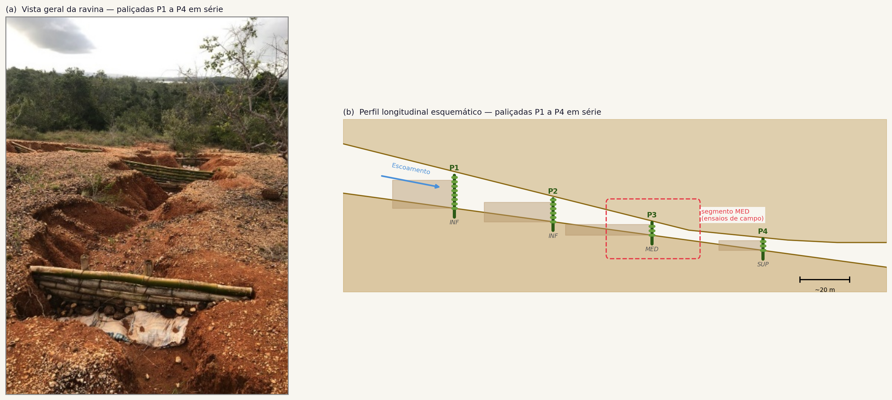
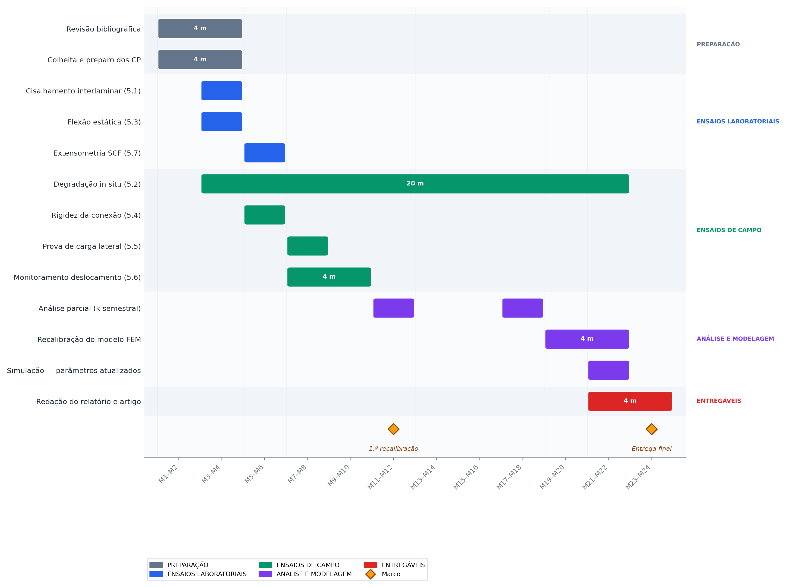

# Resumo

Paliçadas de *Bambusa vulgaris* são empregadas como barreiras permeáveis para controle de erosão linear em regiões tropicais, porém a taxa de degradação mecânica e os modos de falha dominantes do material em contato com solo úmido permanecem desconhecidos. Um modelo de elementos finitos (FEM) previamente desenvolvido indicou que o cisalhamento interlaminar nas zonas nodais responde por 98% do índice de falha, contudo os parâmetros de entrada provêm de espécies e condições ambientais distintas. Este estudo avalia as propriedades mecânicas de colmos de *B. vulgaris* montados em quatro paliçadas dispostas em série no interior da ravina, integrando ensaios laboratoriais, monitoramento de degradação *in situ* e validação de campo para recalibrar o modelo FEM e fundamentar protocolos de manutenção baseados em evidência. Sete ensaios complementares, conduzidos ao longo de 24 meses, integram caracterização laboratorial (cisalhamento interlaminar conforme ASTM D2344, flexão estática conforme ISO 22157 e extensometria para determinação do fator de concentração de tensão), monitoramento de degradação *in situ* com retiradas semestrais, e validação de campo (rigidez rotacional da conexão colmo-estaca, prova de carga lateral e deslocamento das estacas durante eventos de chuva). Os resultados permitirão recalibrar o modelo FEM com medições diretas e variabilidade estimada, subsidiando protocolos de manutenção baseados em evidência para estruturas de bioengenharia de solos.

**Palavras-chave:** bioengenharia de solos; *Bambusa vulgaris*; cisalhamento interlaminar; degradação mecânica; elementos finitos; controle de erosão.

# Introdução e justificativa

O emprego de paliçadas de bambu como barreiras permeáveis para dissipação de energia de enxurradas e retenção de sedimentos em ravinas constitui uma solução de bioengenharia de solos com custo reduzido e viabilidade logística em regiões tropicais [@piton_et_al_2017; @bombino_et_al_2019]. O *Bambusa vulgaris* combina resistência mecânica inicial de 120 a 230 MPa à tração, disponibilidade local e capacidade de brotamento quando parcialmente enterrado, o que o torna atrativo para estruturas de controle de erosão linear [@huzita_noda_kayo_2020; @birnnaum_et_al_2018].

A durabilidade dessas estruturas é, contudo, condicionada pela interação entre a degradação biológica do material construtivo, mediada por fungos, hidrólise e ação de insetos em contato direto com solo úmido, e o preenchimento progressivo da capacidade de armazenamento sedimentar a montante. Estimativas disponíveis indicam perda de até 50% da resistência mecânica em cinco anos para bambu não tratado [@ghimire_et_al_2013], porém as taxas de decaimento ($k$) para *B. vulgaris* em Plintossolo Argilúvico sob regime tropical úmido são desconhecidas.

Um modelo de elementos finitos tridimensional com vigas de Euler-Bernoulli e critério de falha de Tsai-Hill foi desenvolvido para avaliar a integridade estrutural dessas paliçadas ao longo de 10 anos, combinando três taxas de degradação, três cenários hidrológicos e 21 passos de tempo, totalizando 567 combinações [@bacharoudis_philippidis_2015]. O modelo identificou que o cisalhamento interlaminar nas zonas de nó de entrenó responde por 98% do índice de falha no elemento crítico, com amplificação de 230% nas junções colmo-estaca. Sob degradação pessimista ($k = 0{,}10$ ano$^{-1}$), as estacas verticais consumiram 36\% da capacidade resistente residual a $t = 10$ anos.

Embora o modelo forneça indicadores de desempenho e de modo de falha, os parâmetros de entrada provêm majoritariamente de dados publicados para outras espécies (*Phyllostachys edulis*, *Guadua angustifolia*) e condições ambientais distintas, o que limita a confiabilidade das previsões. A resistência ao cisalhamento interlaminar ($\tau_{LR} = 10$ MPa), o módulo de elasticidade longitudinal ($E_L = 12$ GPa), o fator de concentração de tensão nodal ($SCF = 1{,}8$) e a taxa de degradação ($k = 0{,}03$ a $0{,}10$ ano$^{-1}$) carecem de validação para o material e o sítio experimental específicos. A conexão colmo-estaca por arame recozido é idealizada como junta rígida, e a interação solo-estrutura é representada por engaste total, simplificações cuja sensibilidade paramétrica propaga incerteza relevante no índice de falha.

A hipótese central é que os parâmetros mecânicos reais de *B. vulgaris* em contato com Plintossolo Argilúvico diferem dos valores adotados a partir de outras espécies e condições, e que a taxa de degradação do cisalhamento interlaminar ($k_\tau$) excede a taxa de degradação da resistência à flexão ($k_\sigma$), tornando o modo cisalhante ainda mais dominante ao longo do tempo do que o previsto pelo modelo com $k$ uniforme. Este estudo avalia as propriedades mecânicas de colmos de *B. vulgaris* montados em quatro paliçadas dispostas em série no interior da ravina, integrando ensaios laboratoriais, monitoramento de degradação *in situ* e validação de campo para recalibrar o modelo FEM e fundamentar protocolos de manutenção baseados em evidência.

# Objetivos

## Objetivo geral

Avaliar experimentalmente as propriedades mecânicas de *Bambusa vulgaris* e as condições de contorno de paliçadas de controle de erosão linear instaladas sobre Plintossolo Argilúvico distrófico, visando à recalibração do modelo de elementos finitos e à atualização dos critérios de manutenção.

## Objetivos específicos

(a) Determinar a resistência ao cisalhamento interlaminar ($\tau_{LR}$) de regiões nodais e internodais de colmos de *B. vulgaris* provenientes do sítio experimental.

(b) Estimar as taxas de decaimento do cisalhamento interlaminar ($k_\tau$) e da resistência à flexão ($k_\sigma$) de *B. vulgaris* sob exposição ao Plintossolo Argilúvico.

(c) Caracterizar o módulo de elasticidade longitudinal ($E_L$) e a resistência à flexão ($\sigma_{fL}$) de colmos inteiros de *B. vulgaris* por classe de diâmetro.

(d) Quantificar a rigidez rotacional ($k_\theta$) da conexão arame-colmo-estaca e o coeficiente de reação horizontal do solo ($k_h$) das estacas verticais.

(g) Avaliar o desempenho do modelo de elementos finitos recalibrado com os parâmetros experimentais obtidos, em termos de fatores de segurança e cenários de vida útil.

# Metas a serem alcançadas

A conclusão dos ensaios laboratoriais de cisalhamento interlaminar, flexão estática e extensometria nos primeiros seis meses constituirá a primeira meta, fornecendo os parâmetros mecânicos de referência para substituição dos valores da literatura no modelo FEM. A instalação do ensaio de degradação *in situ* e as duas primeiras retiradas semestrais permitirão estimar preliminarmente as taxas de decaimento $k_\tau$ e $k_\sigma$ até o décimo segundo mês, viabilizando a primeira rodada de recalibração. A validação das condições de contorno em campo, incluindo rigidez rotacional, reação horizontal do solo e deslocamento lateral durante eventos de chuva, será concluída até o décimo mês. A recalibração final do modelo FEM e a submissão do artigo científico ao periódico-alvo constituem a meta de encerramento do projeto.

# Fundamentação teórica

Paliçadas permeáveis operam como barreiras de dissipação de energia hidráulica e retenção de sedimentos em feições erosivas lineares, reduzindo a velocidade do escoamento concentrado e promovendo deposição preferencial a montante [@piton_et_al_2017; @ramos_diez_et_al_2017]. A eficiência dessas estruturas depende da relação entre a carga hidrodinâmica imposta pelo escoamento e a resistência mecânica residual do material construtivo ao longo do tempo, configurando um problema de integridade estrutural governado pela degradação progressiva das propriedades do material [@bombino_et_al_2019; @nichols_polyakov_2019].

O bambu é um material natural compósito de estrutura hierárquica, composto por fibras celulósicas embebidas em matriz de lignina e hemicelulose, com propriedades mecânicas fortemente anisotrópicas. O *Bambusa vulgaris*, espécie pantropical de elevada disponibilidade no Nordeste brasileiro, apresenta resistência à tração longitudinal de 120 a 230 MPa e módulo de elasticidade de 8 a 20 GPa, com variação condicionada pela posição no colmo, idade de corte e teor de umidade [@shah_et_al_2017; @meng_et_al_2023]. As zonas nodais constituem descontinuidades geométricas e microestruturais que amplificam tensões locais, funcionando como concentradores de tensão cuja magnitude permanece pouco caracterizada para espécies tropicais [@budhe_et_al_2019].

A degradação de bambu em contato com solo úmido resulta da ação combinada de fungos xilófagos, hidrólise das hemiceluloses e ataque de insetos, processos que reduzem progressivamente a área resistente e as propriedades intrínsecas do material [@ghimire_et_al_2013; @mushi_et_al_2019]. O decaimento é modelado por função exponencial ($P(t)/P_0 = e^{-k \cdot t}$), porém os valores de $k$ publicados referem-se predominantemente a *Phyllostachys* e *Guadua* em climas temperados ou subtropicais, sem validação para *B. vulgaris* em Plintossolo Argilúvico sob regime tropical úmido [@prasanthi_et_al_2022; @iwasaki_et_al_2022].

O critério de falha de Tsai-Hill, amplamente empregado na análise de materiais compósitos ortotrópicos, permite combinar os estados de tensão longitudinal, transversal e cisalhante em um índice escalar de falha ($FI$), possibilitando a identificação do modo dominante e do elemento crítico na estrutura [@bacharoudis_philippidis_2015]. A aplicação desse critério a paliçadas de bambu requer, contudo, parâmetros de entrada específicos da espécie e das condições de serviço, cuja ausência justifica o programa experimental ora proposto.

# Metodologia 

## Área de estudo e material vegetal

Os ensaios utilizarão colmos de *Bambusa vulgaris* Schrad. ex J.C. Wendl. colhidos em touceiras adultas (idade de corte $\geq$ 3 anos) localizadas no entorno da Estação Experimental Campus Rural da Universidade Federal de Sergipe, São Cristóvão, SE (10°55'28,8" S; 37°11'58,9" O), fonte do material empregado na construção das paliçadas P1 a P4 instaladas sobre Plintossolo Argilúvico distrófico (Figura 1).

{width="6.5in"}

A seleção dos colmos seguirá critérios de diâmetro externo compatível com o modelo FEM (90 a 110 mm), espessura de parede de 12 a 18 mm e ausência de danos mecânicos visíveis ou infestação por insetos. Os colmos serão seccionados em segmentos de 1,0 m, acondicionados em sacos plásticos e transportados ao laboratório no mesmo dia da colheita para minimizar variação de umidade. As coordenadas de colheita, o diâmetro externo, a espessura de parede e a posição do entrenó serão registradas para cada segmento, assegurando rastreabilidade entre corpo de prova e colmo de origem. As paliçadas P1 a P4, instaladas em série no leito da ravina (Figura 2), são compostas por colmos horizontais fixados por arame recozido às estacas verticais parcialmente cravadas no solo, com confinamento lateral nos taludes.

{width="6.5in"}

O solo é classificado como Plintossolo Argilúvico distrófico (Figura 3), com horizonte Bt de elevada impedância hidráulica (40 a 150+ cm de profundidade), baixa coesão efetiva nos horizontes superficiais e textura argilosa a partir de 10 cm de profundidade. O clima é tropical úmido (As, Köppen-Geiger), com precipitação anual média de 1.092 mm e estação chuvosa concentrada entre março e julho.

{width="2.5in"}

Os ensaios de campo serão realizados no segmento MED ($L = 3{,}00$ m, $H = 0{,}76$ m, três estacas espaçadas 1,50 m), que acumula os maiores índices de falha previstos pelo modelo ($FI_{max} = 0{,}36$ a $t = 10$ anos sob degradação pessimista). A vista geral da ravina experimental e o perfil longitudinal com a posição das paliçadas são apresentados na Figura 4.

{width="6.5in"}

## Ensaio de cisalhamento interlaminar (regiões nodal e internodal)

A resistência ao cisalhamento interlaminar ($\tau_{LR}$) será determinada pelo método da viga curta conforme ASTM D2344/D2344M, adaptado para material natural ortotrópico segundo recomendações de @meng_et_al_2023 e @sharma_et_al_2015, com referência complementar da ISO 22157:2019. De cada colmo selecionado, dois tipos de corpo de prova serão extraídos com serra de bancada refrigerada, um internodal proveniente do terço central do entrenó e outro nodal centrado no diafragma do nó [@liese_1998].

As dimensões nominais seguirão a relação span/thickness = 4 prescrita pela norma (ISO 22157:2019), com comprimento $L = 4h + 2$ mm, largura $b = h$ e espessura $h$ igual à espessura de parede do colmo (12 a 18 mm). O plano de cisalhamento será orientado na direção longitudinal-radial (L-R), coincidente com o plano de falha interlaminar do modelo FEM. Serão preparados 10 corpos de prova internodais e 10 nodais por colmo, totalizando 5 colmos e 100 corpos de prova. A umidade de equilíbrio será estabilizada em câmara climatizada a 20 ± 2 °C e 65 ± 5% UR por 72 h antes do ensaio.

Os corpos de prova serão posicionados em dispositivo de flexão de três pontos com rolos de 6 mm de diâmetro, montados em máquina universal de ensaios (capacidade mínima de 10 kN, célula de carga Classe 1 conforme ISO 7500-1), com velocidade de carregamento de 1,0 mm/min até ruptura ou queda de 30% da carga máxima. A resistência ao cisalhamento interlaminar aparente será calculada por $\tau_{LR} = 0{,}75 \cdot F_{max} / (b \cdot h)$, e o fator de redução nodal será obtido pela razão $\bar{\tau}_{nodal} / \bar{\tau}_{internodal}$. A significância da diferença entre regiões será avaliada pelo teste t de Student (ou Mann-Whitney U, se a normalidade for rejeitada por Shapiro-Wilk, $\alpha = 0{,}05$).

## Ensaio de degradação *in situ*

A taxa de decaimento real ($k$) das propriedades mecânicas de *B. vulgaris* em contato com o Plintossolo Argilúvico será determinada por ensaio de exposição *in situ* ao longo de 30 meses, com retiradas destrutivas a cada 6 meses ($t = 0$, 6, 12, 18, 24 e 30 meses). Corpos de prova de cisalhamento (Seção 5.1) e de flexão (Seção 5.3) serão distribuídos em dois tratamentos, o primeiro enterrado a 15 cm de profundidade no leito da ravina, adjacente às paliçadas existentes e simulando a condição de exposição real das estacas, e o segundo mantido como controle em estufa (20 ± 2 °C, 65 ± 5% UR). Os corpos de prova enterrados serão acondicionados em sacos de tela (mesh 2 mm) que permitem contato com solo e biota sem perda de fragmentos, com identificação individual por plaqueta de aço inoxidável.

Em cada retirada, 10 corpos de prova de cisalhamento (5 nodais + 5 internodais) e 10 de flexão serão extraídos, limpos com escova macia, estabilizados em estufa por 72 h e ensaiados. O total estimado é de 140 corpos de prova (60 de cisalhamento + 60 de flexão + 20 controles). O valor médio normalizado pelo controle ($P(t)/P_0$) será ajustado pelo modelo exponencial $P(t)/P_0 = e^{-k \cdot t}$, estimando $k$ por regressão não linear com intervalo de confiança de 95%. A hipótese de degradação diferencial ($k_\tau \neq k_\sigma$) será testada pelo teste F de modelos encaixados. A espessura residual dos corpos de prova a cada retirada será medida por paquímetro digital em três posições equidistantes para estimar a taxa de afinamento de parede (mm/mês) e comparar ao valor de 1 mm ano$^{-1}$ adotado no modelo.

Um sensor de temperatura e umidade do solo (tipo capacitivo, resolução 0,1 °C / 0,1% v/v) será instalado a 15 cm de profundidade, adjacente aos corpos de prova, com registro horário em datalogger autônomo. A precipitação diária será obtida da estação meteorológica automática de Aracaju-SE (INMET).

A concentração dos corpos de prova enterrados e dos instrumentos de campo no segmento MED resultará numa sobreposição espacial que exigirá planejamento de layout para evitar interferência entre ensaios simultâneos (Figura 5). A disposição dos sacos de tela com corpos de prova a montante da paliçada, na zona de deposição sedimentar, e a instalação dos extensômetros, comparadores de deslocamento, macaco de prova de carga e inclinômetros nos colmos e estacas instrumentados seguirão o arranjo indicado nos painéis (a) e (b), que orientará a sequência de colheita semestral sem perturbação dos sensores permanentes.

{width="6.5in"}

## Ensaio de flexão estática em colmos inteiros

O módulo de elasticidade longitudinal ($E_L$), a resistência à flexão ($\sigma_{fL}$) e a resistência à compressão longitudinal ($\sigma_{cL}$) serão determinados em colmos inteiros conforme ISO 22157:2019, Seção 11, complementada pela ASTM D3043 [@janssen_2000; @sharma_et_al_2015; @trujillo_et_al_2017], com relação span/diâmetro mantida entre 20 e 30. A estratificação por classe de diâmetro segue o procedimento de @correal_arbelaez_2010, que demonstraram dependência das propriedades de flexão com a geometria da seção em *Guadua angustifolia*. Segmentos de colmo com 600 a 900 mm de comprimento (mínimo de 2 entrenós completos) serão selecionados conforme critérios da Seção 4, totalizando 15 colmos distribuídos em três classes de diâmetro (90--95 mm, 96--102 mm, 103--110 mm). As dimensões serão medidas por paquímetro digital em três seções (apoio esquerdo, centro, apoio direito).

O ensaio de flexão em quatro pontos será conduzido em máquina universal (capacidade 50 kN) com distância entre apoios de 20 a 30 vezes o diâmetro externo médio e distância entre pontos de carga de $L_{span}/3$, com velocidade de deslocamento de 5 mm/min [@dixon_gibson_2014; @richard_2013]. O deslocamento no centro do vão será medido por extensômetro LVDT (curso 50 mm, resolução 0,01 mm). O módulo de elasticidade será calculado por $E_L = 23 \Delta F \cdot L_{span}^3 / (1296 \cdot \Delta \delta \cdot I)$, onde $\Delta F / \Delta \delta$ é a taxa de carga-deslocamento no trecho linear e $I$ o momento de inércia da seção tubular oca. A resistência à flexão será obtida por $\sigma_{fL} = M_{max} \cdot c / I$. O efeito da classe de diâmetro sobre as propriedades será avaliado por ANOVA unidirecional.

## Ensaio de rigidez rotacional da conexão arame-colmo-estaca

A rigidez rotacional ($k_\theta$, em kN·m/rad) da conexão colmo-estaca por arame recozido será determinada em configuração de bancada que reproduzirá a geometria de campo, seguindo o protocolo de caracterização de junções de bambu descrito por @nurmadina_et_al_2017 e as recomendações de @kaminski_et_al_2016. Uma estaca vertical de *B. vulgaris* (diâmetro externo 100 mm, comprimento 600 mm) será engastada em bloco de concreto a 300 mm de profundidade. Um colmo horizontal será amarrado à estaca com arame recozido n.° 18 (três voltas cruzadas com torção manual, conforme padrão de campo), com extremidade livre como braço de alavanca (400 mm). A carga transversal será aplicada por célula de carga (capacidade 2 kN, Classe 1), e a rotação relativa será medida por dois inclinômetros digitais (resolução 0,01°) fixados a 50 mm de cada lado da junção.

Após ciclos de acomodação (0 → 100 N → 0, três repetições), o carregamento monotônico prosseguirá até deslizamento visível ou rotação de 5°. A rigidez será obtida pela inclinação da região linear da curva momento-rotação: $k_\theta = \Delta M / \Delta \theta$ [@richard_2013]. Serão ensaiadas 10 junções em condição nova e 10 junções retiradas de campo após 8 meses, e a razão $k_{\theta,8meses} / k_{\theta,novo}$ quantificará a degradação no ciclo de manutenção.

## Prova de carga lateral em estacas *in situ*

A curva carga-deslocamento lateral ($p$-$y$) de estacas de *B. vulgaris* cravadas no Plintossolo Argilúvico será obtida em três estacas do segmento MED (externas E1 e E3, central E2), com pelo menos 6 meses de reconsolidação do solo, seguindo o protocolo de @broms_1964 e a formulação de curvas $p$-$y$ de @matlock_1970. O carregamento lateral será aplicado por macaco hidráulico (capacidade 20 kN) posicionado a 50 mm acima do nível do solo, reagindo contra viga de referência ancorada em estacas de aço independentes a distância mínima de 2 m. A carga será medida por célula de carga digital (resolução 1 N) e o deslocamento lateral no ponto de aplicação por dois comparadores mecânicos (curso 25 mm, resolução 0,01 mm), com terceiro comparador a 300 mm acima para registro do perfil de deslocamento.

O carregamento seguirá protocolo incremental com patamares de 0,25 kN mantidos por 5 minutos, até carga máxima de 5 kN ou deslocamento de 15 mm. Serão executados três ciclos em cada estaca. O coeficiente de reação horizontal ($k_h$) será calculado pela inclinação da região linear do primeiro ciclo: $k_h = \Delta p / (\Delta y \cdot D_{ext})$ [@broms_1964], e comparado à faixa de 10 a 20 MN/m³ admitida no modelo para solos argilosos.

## Monitoramento de deslocamento lateral *in situ*

O deslocamento lateral real no topo das estacas do segmento MED durante eventos de chuva será monitorado por comparadores mecânicos de longa duração (curso 25 mm, resolução 0,01 mm, protegidos por cápsula de PVC) instalados em duas estacas (central E2 e uma estaca externa), fixados em suportes metálicos ancorados nos taludes laterais da ravina, conforme protocolo de monitoramento de desempenho de estruturas de controle de erosão descrito por @bombino_et_al_2007 e @tardio_mickovski_2017. O monitoramento cobrirá uma estação chuvosa completa (maio a agosto), com leituras antes e depois de cada evento de chuva identificável (>10 mm acumulados), totalizando 15 a 25 eventos estimados. Para cada evento, serão registrados o deslocamento lateral, a precipitação acumulada, o nível de água a montante e a jusante da paliçada e a altura do depósito sedimentar.

O deslocamento medido será comparado com a previsão do modelo FEM para o mesmo instante temporal e percentual de preenchimento sedimentar. Regressão linear entre deslocamento e precipitação acumulada estimará a sensibilidade hidromecânica da estrutura. Discrepância sistemática superior a 30% entre medido e simulado desencadeará recalibração por análise inversa.

## Ensaio de fator de concentração de tensão por extensometria

O fator de concentração de tensão (SCF) real nas zonas nodais e junções colmo-estaca [@pilkey_pilkey_2008] será determinado por extensômetros de resistência elétrica (strain gauges uniaxiais, base de 5 mm, fator de gauge 2,0 ± 0,5%) colados em colmos inteiros. Três extensômetros serão posicionados na zona internodal, no terço central do entrenó e espaçados 120° na circunferência, enquanto outros três serão instalados na zona nodal a 5 mm de cada lado do diafragma e sobre o próprio diafragma, e um terceiro conjunto de três extensômetros será disposto na zona de junção colmo-estaca a 5 mm acima e 5 mm abaixo do ponto de amarração e sobre o arame.

Colmos de 600 mm (com nó no terço central) serão submetidos a flexão em quatro pontos conforme Seção 5.3, com carregamento incremental em patamares de 0,5 kN mantidos por 30 segundos. As deformações serão adquiridas por condicionador de sinais (ponte de Wheatstone 1/4, excitação 2,5 V) a 10 Hz. O SCF será calculado como $SCF = \varepsilon_{max,nodal} / \varepsilon_{nominal,internodal}$ para cada nível de carga. Serão ensaiados 8 colmos (4 com nó, 4 com junção amarrada), reportando média, desvio padrão e intervalo de confiança de 95%.

## Recalibração do modelo FEM

Os parâmetros experimentais obtidos nos ensaios 5.1 a 5.7 serão incorporados ao modelo tridimensional de elementos finitos com vigas de Euler-Bernoulli (12 DOF) e critério de falha de Tsai-Hill [@tsai_wu_1971; @daniel_ishai_2006; @bacharoudis_philippidis_2015]. A substituição abrangerá o $\tau_{LR}$ e o fator de redução nodal obtidos no ensaio de cisalhamento, as curvas de degradação $k_\tau$ e $k_\sigma$ derivadas do monitoramento *in situ*, o $E_L$ e a $\sigma_{fL}$ com variabilidade estimada na flexão estática, o $k_\theta$ da conexão colmo-estaca, o $k_h$ para molas de Winkler [@hetenyi_1946; @reese_van_impe_2011] em substituição ao engaste, a validação direta de deslocamento em campo e o SCF nas zonas de concentração de tensão. Os fatores de segurança, os limiares de manutenção e os cenários de vida útil serão recalculados com base nos novos parâmetros.

Os principais equipamentos previstos para a execução dos ensaios laboratoriais e de campo são apresentados na Figura 6, que ilustra a máquina universal de ensaios mecânicos, extensômetros de resistência elétrica com aplicação em corpo de prova compósito, célula de carga, comparador mecânico e macaco hidráulico.

{width="6.5in"}

## Análise estatística

Cada variável resposta é inicialmente submetida à verificação de pressupostos mediante teste de Shapiro-Wilk [@shapiro_wilk_1965] para normalidade e teste de Levene para homoscedasticidade ($\alpha = 0{,}05$). Dado que dados de resistência mecânica são estritamente positivos e tipicamente assimétricos, adota-se preferencialmente o Modelo Linear Generalizado [GLM; @mccullagh_nelder_1989] com distribuição Gamma e função de ligação logarítmica, com adequação avaliada pelas razões Desvio/gl e Pearson/gl (< 1,0 indica ajuste satisfatório). A seleção entre modelos concorrentes (Gaussiano, Gamma, exponencial, potência, log-quadrático) é conduzida pelos critérios de informação de Akaike [AIC; @akaike_1974] e bayesiano (BIC), privilegiando o modelo com menor AIC.

A estrutura longitudinal do ensaio de degradação *in situ* (6 tempos × 2 tratamentos × $n$ réplicas) é analisada por Equações de Estimação Generalizadas [GEE; @liang_zeger_1986] com família Gamma, função de ligação log e matriz de correlação autorregressiva de primeira ordem (AR-1), selecionada pelo critério QIC (*quasi-likelihood information criterion*). A robustez dos erros-padrão é garantida pelo estimador sanduíche de Huber-White, e a significância dos efeitos é testada pela estatística de Wald ($\chi^2$). Para amostras pequenas (ensaios 5.4, 5.5, 5.6), os intervalos de confiança de 95% são obtidos por bootstrap não paramétrico (1.000 iterações) com correção BCa [*Bias-Corrected and Accelerated*; @efron_tibshirani_1993], o que dispensa a premissa de normalidade assintótica.

A cinética de degradação é modelada assumindo decaimento de primeira ordem ($P(t) = P_0 \cdot e^{-k \cdot t}$), com parâmetros estimados por regressão não linear [Levenberg-Marquardt; @marquardt_1963]. A confiabilidade mecânica ao longo do tempo é avaliada pela distribuição de Weibull de dois parâmetros [$\beta$, $\eta$; @weibull_1951], ajustada por máxima verossimilhança, com qualidade verificada pelos testes de Anderson-Darling e Kolmogorov-Smirnov. A vida útil funcional (VUF) corresponde ao tempo para 10% de probabilidade de falha ($P_{10}$), e a incerteza dos parâmetros ($k$, $\beta$, $\eta$) é quantificada por simulação de Monte Carlo (1.000 iterações). A validação preditiva do modelo exponencial é verificada por validação cruzada leave-one-out (LOOCV)*, confrontando os valores preditos com os observados em cada retirada semestral.

Comparações entre grupos independentes (internodal *versus* nodal, degradado *versus* controle) empregam Kruskal-Wallis quando a premissa de normalidade é rejeitada, e ANOVA seguida de Tukey HSD ($p < 0{,}05$) quando os pressupostos paramétricos são atendidos. O tamanho de efeito é reportado sistematicamente pelo *d* de Cohen para comparações pareadas e pelo $\eta^2$ parcial para modelos com múltiplos fatores, seguindo os limiares convencionais de @cohen_1988 (0,01 pequeno, 0,06 médio, 0,14 grande). Correlações entre propriedades mecânicas e variáveis geométricas (diâmetro, espessura de parede, posição no colmo) são avaliadas pelo coeficiente de Spearman ($\rho$), sendo o de Pearson ($r$) reservado a variáveis com distribuição aproximadamente normal.

A análise multivariada dos sete ensaios é conduzida por Análise de Componentes Principais [PCA; @jolliffe_2002] após padronização *z-score*, com retenção de componentes pela regra de Kaiser (autovalores > 1) e rotação Varimax, de modo a identificar agrupamentos entre propriedades mecânicas e condições de contorno que compartilham variância comum. Cargas fatoriais com módulo $\geq 0{,}40$ são consideradas significantes para interpretação. Todas as análises são conduzidas em Python (≥ 3.11, bibliotecas `scipy`, `statsmodels`, `lifelines`) e R (≥ 4.3.1, pacotes `car`, `geepack`, `WeibullR`, `emmeans`, `boot`, `FactoMineR`), com scripts versionados no repositório do projeto.

# Plano amostral

**Tabela 1** -- Resumo do plano amostral, equipamentos e duração estimada por ensaio

| Ensaio | n total (CP/medições) | Equipamento principal | Duração |
|---|---|---|---|
| 5.1 Cisalhamento interlaminar | 100 CP | Máquina universal 10 kN | 2 semanas |
| 5.2 Degradação *in situ* | 140 CP (6 retiradas) | Máquina universal + estufa | 30 meses |
| 5.3 Flexão estática | 15 colmos | Máquina universal 50 kN + LVDT | 2 semanas |
| 5.4 Rigidez da conexão | 20 junções | Célula de carga 2 kN + inclinômetros | 1 semana |
| 5.5 Prova de carga lateral | 3 estacas | Macaco hidráulico 20 kN + comparadores | 3 dias |
| 5.6 Deslocamento *in situ* | 2 estacas (15--25 eventos) | Comparadores mecânicos ou LVDT | 4 meses |
| 5.7 Extensometria (SCF) | 8 colmos | Strain gauges + condicionador | 2 semanas |

# Cronograma de atividades (24 meses)

{width="6.5in"}

# Resultados esperados

Os ensaios experimentais e a subsequente recalibração do modelo FEM permitirão substituir os parâmetros mecânicos da literatura ($\tau_{LR}$, $E_L$, $\sigma_{fL}$, SCF) por valores medidos com variabilidade estimada para *B. vulgaris* do sítio experimental, ao mesmo tempo em que a curva de degradação real em Plintossolo Argilúvico será estabelecida, separando o decaimento do cisalhamento ($k_\tau$) do decaimento da flexão ($k_\sigma$). A validação em campo das condições de contorno, incluindo rigidez da conexão, reação do solo e deslocamento lateral, substituirá as simplificações de engaste e junta rígida por respostas medidas. A convergência desses dados possibilitará o recálculo dos fatores de segurança e dos limiares de manutenção com base em parâmetros experimentais, fornecendo subsídios para protocolos de intervenção baseados em evidência. Ao término do projeto, espera-se a submissão de um artigo científico a periódico indexado na área de mecânica de materiais ou bioengenharia.

# Referências